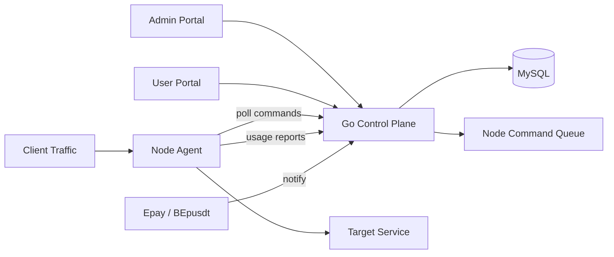

# Traffic Forwarding Panel

This repository is a greenfield traffic forwarding panel inspired by `bqlpfy/flux-panel`.

The implementation keeps the original control-plane/data-plane idea, but rebuilds it as a single Go binary with MySQL persistence, admin/user web portals, node-agent mode, TCP/UDP forwarding, Epay and BEpusdt payment adapters, and deployment assets for Docker, 1Panel, aaPanel, and AcePanel-style Linux panels.

## Architecture



## Workflow

1. Admin creates users, nodes, and tunnels.
2. A tunnel creates one `forward_services` row and one node command.
3. The node agent polls `/api/nodes/commands`, starts a local TCP or UDP listener, and proxies traffic to the configured target.
4. The node agent reports traffic deltas to `/api/nodes/report`.
5. The control plane updates `forward_services`, `tunnels`, and `users` counters in MySQL.
6. Quota or expiry violations enqueue a pause command for the node.
7. Users can create recharge orders through the Epay or BEpusdt payment plugin interface.

Service identity follows the same practical pattern as flux-panel: a stable `service_key` binds user, node, tunnel, and runtime state so billing, pause/resume, deletion, and accounting all operate on the same key.

TCP forwarding uses one goroutine pair per accepted connection. UDP forwarding uses a NAT-style session table keyed by client address, dials the configured UDP target per active client, relays response datagrams back to the original client, and expires idle sessions with `TP_AGENT_UDP_IDLE_TIMEOUT`.

## Storage

All persisted state is stored in MySQL:

- `admins`, `users`, `sessions`
- `nodes`, `tunnels`, `forward_services`, `node_commands`
- `usage_reports`
- `payment_channels`, `payment_orders`
- `audit_logs`

Schema creation runs automatically on server startup.

## Build

Local build:

```sh
go test ./...
go build -trimpath -ldflags="-s -w" -o bin/trafficpanel ./cmd/trafficpanel
```

Linux `amd64` and `arm64`:

```powershell
.\scripts\build-multiarch.ps1
```

Docker multi-arch:

```sh
docker buildx build --platform linux/amd64,linux/arm64 -t trafficpanel:latest .
```

## Docker / 1Panel

Generic Docker:

```sh
cp deploy/env.example .env
docker compose up -d --build
```

1Panel:

1. Build or publish a `trafficpanel:latest` image for `linux/amd64,linux/arm64`.
2. Use `deploy/1panel/docker-compose.yml` in a custom app or local app package.
3. Set `PANEL_DB_*`, `PANEL_BASE_URL`, `PANEL_MASTER_SECRET`, and admin password variables.

The 1Panel packaging follows the same Docker Compose application model used by the official [1Panel repository](https://github.com/1Panel-dev/1Panel).

## aaPanel

The aaPanel path uses conventional Linux deployment, matching aaPanel's host-managed application style from the official [aaPanel repository](https://github.com/aaPanel/aaPanel).

```sh
cp dist/trafficpanel-linux-amd64 ./trafficpanel
MYSQL_HOST=127.0.0.1 \
MYSQL_DATABASE=traffic_panel \
MYSQL_USER=trafficpanel \
MYSQL_PASSWORD='replace-me' \
BASE_URL=https://panel.example.com \
MASTER_SECRET='replace-with-long-random' \
ADMIN_PASSWORD='replace-me' \
sh scripts/install-linux.sh
```

Then configure an aaPanel reverse proxy to `127.0.0.1:8080`.

## AcePanel

AcePanel's official repository is [acepanel/panel](https://github.com/acepanel/panel). Its README describes a lightweight Go-based server operations panel with single-file runtime, and its install documentation lists `amd64` and `arm64` as supported architectures.

This repository ships an AcePanel-compatible flow in `deploy/acepanel/README.md`:

1. Install AcePanel from the official script or source.
2. Create a MySQL database/user in AcePanel.
3. Upload the correct `trafficpanel-linux-amd64` or `trafficpanel-linux-arm64` binary.
4. Run `scripts/install-linux.sh`.
5. Configure AcePanel website reverse proxy to `127.0.0.1:8080`.

## Node Deployment

Create a node in the admin console, then deploy the same binary in node mode:

```sh
cp dist/trafficpanel-linux-amd64 ./trafficpanel
AGENT_SERVER_URL=https://panel.example.com \
AGENT_NODE_ID=1 \
AGENT_NODE_SECRET='secret-from-admin-node' \
AGENT_NODE_NAME=edge-1 \
AGENT_NODE_HOST=203.0.113.10 \
sh scripts/install-node-linux.sh
```

## Runtime Configuration

Server variables:

- `TP_MODE=server`
- `TP_HTTP_ADDR=:8080`
- `TP_DATABASE_DSN=user:pass@tcp(host:3306)/traffic_panel?parseTime=true&charset=utf8mb4&loc=Local`
- `TP_BASE_URL=https://panel.example.com`
- `TP_MASTER_SECRET=...`
- `TP_BOOTSTRAP_ADMIN_USER=admin`
- `TP_BOOTSTRAP_ADMIN_PASS=...`

Node variables:

- `TP_MODE=node`
- `TP_AGENT_SERVER_URL=https://panel.example.com`
- `TP_AGENT_NODE_ID=1`
- `TP_AGENT_NODE_SECRET=...`
- `TP_AGENT_NODE_NAME=edge-1`
- `TP_AGENT_NODE_HOST=203.0.113.10`
- `TP_AGENT_UDP_IDLE_TIMEOUT=2m`

## Payment Plugins

Payment providers implement:

```go
type Provider interface {
    Code() string
    Name() string
    CreateOrder(context.Context, PaymentOrderInput) (PaymentOrderResult, error)
    ParseNotify(context.Context, []byte, url.Values) (ProviderNotify, error)
}
```

Built-in adapters are registered as:

- `epay`
- `bepusdt`

They use signed form-gateway parameters:

- `TP_EPAY_API_URL`, `TP_EPAY_PID`, `TP_EPAY_KEY`, `TP_EPAY_TYPE`
- `TP_BEPUSDT_API_URL`, `TP_BEPUSDT_PID`, `TP_BEPUSDT_KEY`, `TP_BEPUSDT_TYPE`

The BEpusdt/Epay compatibility target is based on the public plugin ecosystem around [BEpusdt](https://github.com/BEpusdt/BEpusdt) and [Epay-BEpusdt](https://github.com/v03413/Epay-BEpusdt).
