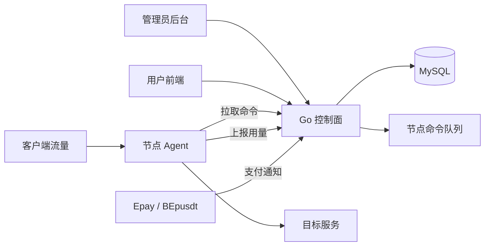
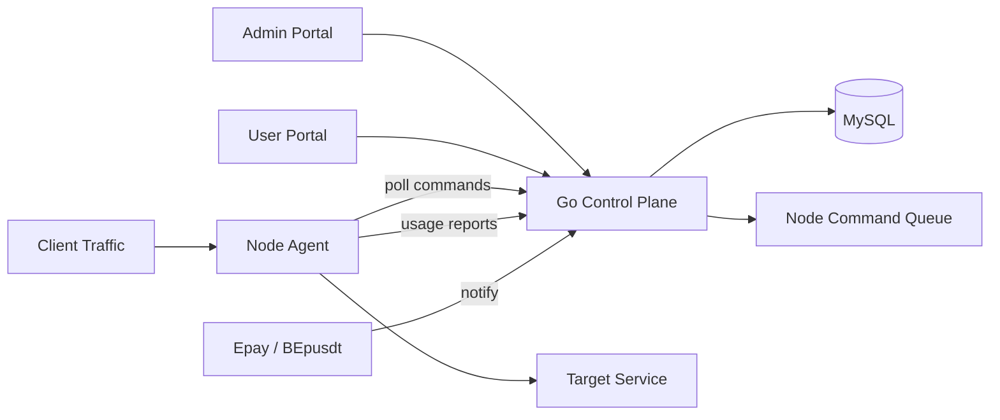

# Traffic Forwarding Panel

- [中文文档](#中文文档)
- [English Documentation](#english-documentation)

## 中文文档

### 项目简介

Traffic Forwarding Panel 是一个参考 `bqlpfy/flux-panel` 控制面/数据面思想重新实现的流量转发面板。项目使用单个 Go 二进制同时支持服务端模式和节点模式，数据持久化使用 MySQL，内置管理员后台、用户前端、TCP/UDP 转发节点、用量统计、额度暂停、Epay 和 BEpusdt 支付插件，并提供 Docker、1Panel、aaPanel、AcePanel 以及普通 Linux systemd 部署方式。

核心能力：

- 管理员后台：用户、节点、隧道、服务、支付订单、用量统计。
- 用户前端：登录、查看隧道、查看订单、创建充值订单。
- 转发内核：节点本地执行 TCP 转发和 UDP NAT-style 会话转发。
- MySQL 存储：所有用户、节点、隧道、服务、账单、审计和用量数据统一落库。
- 多架构构建：支持 `linux/amd64` 和 `linux/arm64`。
- 部署形态：Docker Compose、1Panel、aaPanel、AcePanel、普通 Linux 主机。

### 架构



### 工作流程

1. 管理员创建用户、节点和隧道。
2. 创建隧道时写入 `tunnels` 和 `forward_services`，同时生成节点命令。
3. 节点以 `TP_MODE=node` 运行，定时拉取 `/api/nodes/commands`。
4. 节点收到命令后启动本地 TCP 或 UDP 监听，并将流量转发到目标地址。
5. 节点定时上报 `bytes_in`、`bytes_out`、`active_conn`。
6. 控制面更新 MySQL 中的服务、隧道和用户用量。
7. 用户或隧道额度到达限制、过期时，控制面下发暂停命令。
8. 用户可通过 Epay 或 BEpusdt 插件创建充值订单，支付回调由控制面处理。

`service_key` 是服务运行态和计费态的稳定标识，用于绑定用户、节点、隧道、运行状态、暂停/恢复、删除和用量统计。

### TCP/UDP 转发说明

- TCP：每个入站连接拨号到目标地址，使用双向 `io.Copy` 转发，并统计上下行字节。
- UDP：节点按客户端 UDP 地址建立 NAT-style 会话，每个客户端会话独立拨号目标 UDP 地址，目标响应包回写到原客户端地址。
- UDP 会话会按 `TP_AGENT_UDP_IDLE_TIMEOUT` 自动回收，默认 `2m`。
- `MaxConn` 对 TCP 表示最大活跃连接约束的业务字段，对 UDP 表示最大活跃 UDP 客户端会话数。

### 数据存储

所有持久化数据均存储在 MySQL：

- `admins`、`users`、`sessions`
- `nodes`、`tunnels`、`forward_services`、`node_commands`
- `usage_reports`
- `payment_channels`、`payment_orders`
- `audit_logs`

服务端启动时会自动执行建表和默认管理员初始化。

### 默认账号

默认管理员账号由环境变量控制：

- `TP_BOOTSTRAP_ADMIN_USER=admin`
- `TP_BOOTSTRAP_ADMIN_PASS=admin123456`

生产环境必须修改 `TP_MASTER_SECRET` 和默认管理员密码。

### 本地源码运行

依赖：

- Go `1.26.x`
- MySQL `8.x` 或兼容版本

创建数据库后运行：

```sh
go test ./...
go run ./cmd/trafficpanel
```

默认监听：

```text
http://127.0.0.1:8080
```

常用服务端环境变量：

```sh
TP_MODE=server
TP_HTTP_ADDR=:8080
TP_APP_NAME="Traffic Panel"
TP_BASE_URL=https://panel.example.com
TP_DATABASE_DSN='trafficpanel:password@tcp(127.0.0.1:3306)/traffic_panel?parseTime=true&charset=utf8mb4&loc=Local'
TP_MASTER_SECRET='replace-with-long-random-secret'
TP_BOOTSTRAP_ADMIN_USER=admin
TP_BOOTSTRAP_ADMIN_PASS='replace-me'
```

### 构建

本机平台构建：

```sh
go test ./...
go build -trimpath -ldflags="-s -w" -o bin/trafficpanel ./cmd/trafficpanel
```

Windows PowerShell 构建 Linux `amd64` 和 `arm64`：

```powershell
.\scripts\build-multiarch.ps1
```

手动交叉构建：

```powershell
$env:CGO_ENABLED='0'
$env:GOOS='linux'
$env:GOARCH='amd64'
go build -trimpath -ldflags='-s -w' -o dist\trafficpanel-linux-amd64 .\cmd\trafficpanel

$env:GOARCH='arm64'
go build -trimpath -ldflags='-s -w' -o dist\trafficpanel-linux-arm64 .\cmd\trafficpanel
```

Docker 多架构镜像：

```sh
docker buildx build --platform linux/amd64,linux/arm64 -t trafficpanel:latest .
```

### Docker Compose 部署

适用于普通 Docker 主机，也适合作为 1Panel 自定义应用的基础。

```sh
cp deploy/env.example .env
docker compose up -d --build
```

默认 Compose 包含：

- `mysql`: MySQL 8.4
- `panel`: Traffic Panel 服务端

访问：

```text
http://服务器IP:8080
```

如需修改端口、数据库密码、站点 URL、支付参数，编辑 `.env`：

```sh
TP_HTTP_PORT=8080
TP_BASE_URL=https://panel.example.com
TP_MASTER_SECRET=replace-with-long-random-secret
TP_BOOTSTRAP_ADMIN_USER=admin
TP_BOOTSTRAP_ADMIN_PASS=change-this-password

MYSQL_ROOT_PASSWORD=trafficpanel_root
MYSQL_DATABASE=traffic_panel
MYSQL_USER=trafficpanel
MYSQL_PASSWORD=trafficpanel_pass
```

### 1Panel 部署

项目提供 1Panel 自定义应用文件：

- `deploy/1panel/app.yml`
- `deploy/1panel/docker-compose.yml`

部署步骤：

1. 构建或推送 `linux/amd64,linux/arm64` 的 `trafficpanel:latest` 镜像。
2. 在 1Panel 中创建本地应用或自定义 Compose 应用。
3. 使用 `deploy/1panel/docker-compose.yml`。
4. 配置以下变量：

```sh
PANEL_IMAGE=trafficpanel:latest
PANEL_HTTP_PORT=8080
PANEL_BASE_URL=https://panel.example.com
PANEL_MASTER_SECRET=replace-with-long-random-secret
PANEL_ADMIN_USER=admin
PANEL_ADMIN_PASSWORD=replace-me

PANEL_DB_ROOT_PASSWORD=replace-root-password
PANEL_DB_NAME=traffic_panel
PANEL_DB_USER=trafficpanel
PANEL_DB_PASSWORD=replace-db-password
```

5. 在 1Panel 网站中配置反向代理到 `127.0.0.1:8080`，并绑定 HTTPS。

该部署方式与 1Panel 官方 Docker Compose 应用模型一致。官方仓库：[1Panel-dev/1Panel](https://github.com/1Panel-dev/1Panel)。

### aaPanel 部署

aaPanel 适合使用普通 Linux 主机 + systemd 的部署方式。

步骤：

1. 在 aaPanel 中安装 MySQL。
2. 创建数据库 `traffic_panel` 和数据库用户。
3. 上传对应架构的二进制：
   - `dist/trafficpanel-linux-amd64`
   - `dist/trafficpanel-linux-arm64`
4. 在服务器中重命名为 `trafficpanel`。
5. 执行安装脚本。

示例：

```sh
cp dist/trafficpanel-linux-amd64 ./trafficpanel
MYSQL_HOST=127.0.0.1 \
MYSQL_DATABASE=traffic_panel \
MYSQL_USER=trafficpanel \
MYSQL_PASSWORD='replace-me' \
BASE_URL=https://panel.example.com \
MASTER_SECRET='replace-with-long-random' \
ADMIN_PASSWORD='replace-me' \
sh scripts/install-linux.sh
```

脚本会创建：

- `/usr/local/bin/trafficpanel`
- `/opt/trafficpanel/env`
- `trafficpanel.service`

最后在 aaPanel 网站中配置反向代理到：

```text
127.0.0.1:8080
```

aaPanel 官方仓库：[aaPanel/aaPanel](https://github.com/aaPanel/aaPanel)。

### AcePanel 部署

AcePanel 官方仓库是 [acepanel/panel](https://github.com/acepanel/panel)。官方文档显示 AcePanel 支持 `amd64` 和 `arm64`，项目定位是轻量 Go 单文件服务器运维面板。

Traffic Panel 在 AcePanel 中推荐使用原生进程 + systemd 部署：

1. 安装 AcePanel 并登录面板。
2. 在 AcePanel 中创建 MySQL 数据库和用户。
3. 上传匹配架构的二进制，并重命名为 `trafficpanel`。
4. 执行 `scripts/install-linux.sh`。
5. 在 AcePanel 网站/反向代理功能中转发到 `127.0.0.1:8080`。

示例：

```sh
cp dist/trafficpanel-linux-arm64 ./trafficpanel
MYSQL_HOST=127.0.0.1 \
MYSQL_DATABASE=traffic_panel \
MYSQL_USER=trafficpanel \
MYSQL_PASSWORD='replace-me' \
BASE_URL=https://panel.example.com \
MASTER_SECRET='replace-with-long-random' \
ADMIN_PASSWORD='replace-me' \
sh scripts/install-linux.sh
```

AcePanel 安装文档：[acepanel.github.io/quickstart/install](https://acepanel.github.io/quickstart/install)。

### 普通 Linux systemd 部署

如果不使用任何服务器面板，可以直接使用安装脚本：

```sh
cp dist/trafficpanel-linux-amd64 ./trafficpanel
APP_DIR=/opt/trafficpanel \
BIN=/usr/local/bin/trafficpanel \
SERVICE=trafficpanel \
MYSQL_HOST=127.0.0.1 \
MYSQL_PORT=3306 \
MYSQL_DATABASE=traffic_panel \
MYSQL_USER=trafficpanel \
MYSQL_PASSWORD='replace-me' \
HTTP_ADDR=:8080 \
BASE_URL=https://panel.example.com \
MASTER_SECRET='replace-with-long-random' \
ADMIN_USER=admin \
ADMIN_PASSWORD='replace-me' \
sh scripts/install-linux.sh
```

常用管理命令：

```sh
systemctl status trafficpanel
systemctl restart trafficpanel
journalctl -u trafficpanel -f
```

### 节点部署

节点主机运行同一个二进制，但使用 `TP_MODE=node`。

先在管理员后台创建节点，记录节点 ID 和密钥，然后在节点机器执行：

```sh
cp dist/trafficpanel-linux-amd64 ./trafficpanel
AGENT_SERVER_URL=https://panel.example.com \
AGENT_NODE_ID=1 \
AGENT_NODE_SECRET='secret-from-admin-node' \
AGENT_NODE_NAME=edge-1 \
AGENT_NODE_HOST=203.0.113.10 \
AGENT_NODE_PORT=0 \
AGENT_UDP_IDLE_TIMEOUT=2m \
sh scripts/install-node-linux.sh
```

脚本会创建：

- `/usr/local/bin/trafficpanel`
- `/opt/trafficpanel-node/env`
- `trafficpanel-node.service`

节点运行时变量：

```sh
TP_MODE=node
TP_AGENT_SERVER_URL=https://panel.example.com
TP_AGENT_NODE_ID=1
TP_AGENT_NODE_SECRET=...
TP_AGENT_NODE_NAME=edge-1
TP_AGENT_NODE_HOST=203.0.113.10
TP_AGENT_NODE_PORT=0
TP_NODE_POLL_INTERVAL=3s
TP_NODE_REPORT_INTERVAL=10s
TP_AGENT_UDP_IDLE_TIMEOUT=2m
```

### 支付插件

内置支付渠道：

- `epay`
- `bepusdt`

支付提供者接口：

```go
type Provider interface {
    Code() string
    Name() string
    CreateOrder(context.Context, PaymentOrderInput) (PaymentOrderResult, error)
    ParseNotify(context.Context, []byte, url.Values) (ProviderNotify, error)
}
```

Epay 参数：

```sh
TP_EPAY_API_URL=https://pay.example.com
TP_EPAY_PID=1000
TP_EPAY_KEY=replace-epay-key
TP_EPAY_TYPE=alipay
```

BEpusdt 参数：

```sh
TP_BEPUSDT_API_URL=https://bepusdt.example.com
TP_BEPUSDT_PID=1000
TP_BEPUSDT_KEY=replace-bepusdt-key
TP_BEPUSDT_TYPE=usdt
```

通知地址格式：

```text
https://panel.example.com/api/pay/epay/notify
https://panel.example.com/api/pay/bepusdt/notify
```

BEpusdt/Epay 兼容目标参考公开生态：[BEpusdt](https://github.com/BEpusdt/BEpusdt) 和 [Epay-BEpusdt](https://github.com/v03413/Epay-BEpusdt)。

### 常用环境变量

服务端：

| 变量 | 默认值 | 说明 |
| --- | --- | --- |
| `TP_MODE` | `server` | 运行模式 |
| `TP_HTTP_ADDR` | `:8080` | HTTP 监听地址 |
| `TP_APP_NAME` | `Traffic Panel` | 应用名称 |
| `TP_BASE_URL` | `http://127.0.0.1:8080` | 外部访问 URL |
| `TP_DATABASE_DSN` | 本地 MySQL | MySQL DSN |
| `TP_MASTER_SECRET` | `change-me-in-production` | 主密钥，生产必须修改 |
| `TP_SESSION_TTL` | `24h` | 登录会话有效期 |
| `TP_BOOTSTRAP_ADMIN_USER` | `admin` | 初始管理员用户名 |
| `TP_BOOTSTRAP_ADMIN_PASS` | `admin123456` | 初始管理员密码 |

节点：

| 变量 | 默认值 | 说明 |
| --- | --- | --- |
| `TP_AGENT_SERVER_URL` | `http://127.0.0.1:8080` | 控制面地址 |
| `TP_AGENT_NODE_ID` | `0` | 节点 ID |
| `TP_AGENT_NODE_SECRET` | 空 | 节点密钥 |
| `TP_AGENT_NODE_NAME` | `default-node` | 节点名称 |
| `TP_AGENT_NODE_HOST` | `127.0.0.1` | 节点公网地址 |
| `TP_AGENT_NODE_PORT` | `0` | 节点展示端口 |
| `TP_NODE_POLL_INTERVAL` | `3s` | 命令拉取间隔 |
| `TP_NODE_REPORT_INTERVAL` | `10s` | 用量上报间隔 |
| `TP_AGENT_UDP_IDLE_TIMEOUT` | `2m` | UDP 会话空闲回收时间 |

### 验证

```sh
go test ./...
```

构建产物示例：

```text
dist/trafficpanel-linux-amd64
dist/trafficpanel-linux-arm64
```

### 安全建议

- 生产环境必须修改 `TP_MASTER_SECRET`。
- 生产环境必须修改默认管理员密码。
- MySQL 用户应只授予当前数据库权限。
- 支付回调必须使用 HTTPS。
- 节点密钥应随机生成，并避免复用。
- 对外开放的转发端口需要配合安全组和防火墙管理。

## English Documentation

### Overview

Traffic Forwarding Panel is a greenfield traffic forwarding panel inspired by the control-plane/data-plane model of `bqlpfy/flux-panel`. It ships as one Go binary that can run as either the server or a node agent. It uses MySQL for persistence and includes an admin console, user portal, TCP/UDP forwarding runtime, usage accounting, quota-based pause commands, Epay and BEpusdt payment adapters, and deployment assets for Docker, 1Panel, aaPanel, AcePanel, and plain Linux systemd.

Key capabilities:

- Admin console: users, nodes, tunnels, services, payment orders, and usage statistics.
- User portal: login, tunnel list, order list, and recharge order creation.
- Forwarding runtime: local TCP forwarding and UDP NAT-style session forwarding on nodes.
- MySQL storage: all users, nodes, tunnels, services, billing, audit, and usage records.
- Multi-architecture builds: `linux/amd64` and `linux/arm64`.
- Deployment modes: Docker Compose, 1Panel, aaPanel, AcePanel, and plain Linux hosts.

### Architecture



### Workflow

1. The admin creates users, nodes, and tunnels.
2. Creating a tunnel writes `tunnels` and `forward_services`, then enqueues a node command.
3. A node runs with `TP_MODE=node` and polls `/api/nodes/commands`.
4. The node starts a local TCP or UDP listener and forwards traffic to the target address.
5. The node reports `bytes_in`, `bytes_out`, and `active_conn`.
6. The control plane updates services, tunnels, and user usage in MySQL.
7. Quota or expiry violations enqueue pause commands for the node.
8. Users can create recharge orders through the Epay or BEpusdt adapters.

`service_key` is the stable runtime and billing identity for a service. It binds the user, node, tunnel, runtime state, pause/resume/delete operations, and usage accounting.

### TCP/UDP Forwarding

- TCP: each inbound connection dials the target address and uses bidirectional `io.Copy`.
- UDP: the node creates a NAT-style session per client UDP address, dials the configured target UDP address, and writes target responses back to the original client.
- UDP sessions are expired by `TP_AGENT_UDP_IDLE_TIMEOUT`, defaulting to `2m`.
- `MaxConn` is used as the maximum active UDP client sessions for UDP services.

### Storage

All persisted state is stored in MySQL:

- `admins`, `users`, `sessions`
- `nodes`, `tunnels`, `forward_services`, `node_commands`
- `usage_reports`
- `payment_channels`, `payment_orders`
- `audit_logs`

The server automatically creates the schema and bootstraps the default admin on startup.

### Default Admin

The default admin is controlled by:

- `TP_BOOTSTRAP_ADMIN_USER=admin`
- `TP_BOOTSTRAP_ADMIN_PASS=admin123456`

Change `TP_MASTER_SECRET` and the default admin password before production use.

### Local Source Run

Requirements:

- Go `1.26.x`
- MySQL `8.x` or a compatible version

After creating the database:

```sh
go test ./...
go run ./cmd/trafficpanel
```

Default URL:

```text
http://127.0.0.1:8080
```

Common server variables:

```sh
TP_MODE=server
TP_HTTP_ADDR=:8080
TP_APP_NAME="Traffic Panel"
TP_BASE_URL=https://panel.example.com
TP_DATABASE_DSN='trafficpanel:password@tcp(127.0.0.1:3306)/traffic_panel?parseTime=true&charset=utf8mb4&loc=Local'
TP_MASTER_SECRET='replace-with-long-random-secret'
TP_BOOTSTRAP_ADMIN_USER=admin
TP_BOOTSTRAP_ADMIN_PASS='replace-me'
```

### Build

Build for the local platform:

```sh
go test ./...
go build -trimpath -ldflags="-s -w" -o bin/trafficpanel ./cmd/trafficpanel
```

Build Linux `amd64` and `arm64` on Windows PowerShell:

```powershell
.\scripts\build-multiarch.ps1
```

Manual cross-build:

```powershell
$env:CGO_ENABLED='0'
$env:GOOS='linux'
$env:GOARCH='amd64'
go build -trimpath -ldflags='-s -w' -o dist\trafficpanel-linux-amd64 .\cmd\trafficpanel

$env:GOARCH='arm64'
go build -trimpath -ldflags='-s -w' -o dist\trafficpanel-linux-arm64 .\cmd\trafficpanel
```

Docker multi-arch image:

```sh
docker buildx build --platform linux/amd64,linux/arm64 -t trafficpanel:latest .
```

### Docker Compose Deployment

Use this for plain Docker hosts. It can also be used as the base for a 1Panel custom app.

```sh
cp deploy/env.example .env
docker compose up -d --build
```

The default Compose stack contains:

- `mysql`: MySQL 8.4
- `panel`: Traffic Panel server

Open:

```text
http://SERVER_IP:8080
```

Edit `.env` to change the port, database credentials, public URL, and payment settings:

```sh
TP_HTTP_PORT=8080
TP_BASE_URL=https://panel.example.com
TP_MASTER_SECRET=replace-with-long-random-secret
TP_BOOTSTRAP_ADMIN_USER=admin
TP_BOOTSTRAP_ADMIN_PASS=change-this-password

MYSQL_ROOT_PASSWORD=trafficpanel_root
MYSQL_DATABASE=traffic_panel
MYSQL_USER=trafficpanel
MYSQL_PASSWORD=trafficpanel_pass
```

### 1Panel Deployment

The repository includes 1Panel custom app files:

- `deploy/1panel/app.yml`
- `deploy/1panel/docker-compose.yml`

Steps:

1. Build or publish a `trafficpanel:latest` image for `linux/amd64,linux/arm64`.
2. Create a local app or custom Compose app in 1Panel.
3. Use `deploy/1panel/docker-compose.yml`.
4. Configure these variables:

```sh
PANEL_IMAGE=trafficpanel:latest
PANEL_HTTP_PORT=8080
PANEL_BASE_URL=https://panel.example.com
PANEL_MASTER_SECRET=replace-with-long-random-secret
PANEL_ADMIN_USER=admin
PANEL_ADMIN_PASSWORD=replace-me

PANEL_DB_ROOT_PASSWORD=replace-root-password
PANEL_DB_NAME=traffic_panel
PANEL_DB_USER=trafficpanel
PANEL_DB_PASSWORD=replace-db-password
```

5. Configure a 1Panel website reverse proxy to `127.0.0.1:8080` and enable HTTPS.

This follows the Docker Compose application model used by the official 1Panel project. Official repository: [1Panel-dev/1Panel](https://github.com/1Panel-dev/1Panel).

### aaPanel Deployment

aaPanel is best served by the plain Linux host + systemd flow.

Steps:

1. Install MySQL in aaPanel.
2. Create the `traffic_panel` database and a database user.
3. Upload the matching binary:
   - `dist/trafficpanel-linux-amd64`
   - `dist/trafficpanel-linux-arm64`
4. Rename it to `trafficpanel`.
5. Run the install script.

Example:

```sh
cp dist/trafficpanel-linux-amd64 ./trafficpanel
MYSQL_HOST=127.0.0.1 \
MYSQL_DATABASE=traffic_panel \
MYSQL_USER=trafficpanel \
MYSQL_PASSWORD='replace-me' \
BASE_URL=https://panel.example.com \
MASTER_SECRET='replace-with-long-random' \
ADMIN_PASSWORD='replace-me' \
sh scripts/install-linux.sh
```

The script creates:

- `/usr/local/bin/trafficpanel`
- `/opt/trafficpanel/env`
- `trafficpanel.service`

Then configure an aaPanel website reverse proxy to:

```text
127.0.0.1:8080
```

Official aaPanel repository: [aaPanel/aaPanel](https://github.com/aaPanel/aaPanel).

### AcePanel Deployment

The official AcePanel repository is [acepanel/panel](https://github.com/acepanel/panel). Its documentation lists `amd64` and `arm64` as supported architectures, and the project is positioned as a lightweight Go single-file server operations panel.

For AcePanel, deploy Traffic Panel as a native systemd process:

1. Install AcePanel and sign in.
2. Create a MySQL database and user in AcePanel.
3. Upload the matching binary and rename it to `trafficpanel`.
4. Run `scripts/install-linux.sh`.
5. Configure an AcePanel website/reverse proxy to `127.0.0.1:8080`.

Example:

```sh
cp dist/trafficpanel-linux-arm64 ./trafficpanel
MYSQL_HOST=127.0.0.1 \
MYSQL_DATABASE=traffic_panel \
MYSQL_USER=trafficpanel \
MYSQL_PASSWORD='replace-me' \
BASE_URL=https://panel.example.com \
MASTER_SECRET='replace-with-long-random' \
ADMIN_PASSWORD='replace-me' \
sh scripts/install-linux.sh
```

AcePanel install documentation: [acepanel.github.io/quickstart/install](https://acepanel.github.io/quickstart/install).

### Plain Linux systemd Deployment

If you do not use a server panel, use the install script directly:

```sh
cp dist/trafficpanel-linux-amd64 ./trafficpanel
APP_DIR=/opt/trafficpanel \
BIN=/usr/local/bin/trafficpanel \
SERVICE=trafficpanel \
MYSQL_HOST=127.0.0.1 \
MYSQL_PORT=3306 \
MYSQL_DATABASE=traffic_panel \
MYSQL_USER=trafficpanel \
MYSQL_PASSWORD='replace-me' \
HTTP_ADDR=:8080 \
BASE_URL=https://panel.example.com \
MASTER_SECRET='replace-with-long-random' \
ADMIN_USER=admin \
ADMIN_PASSWORD='replace-me' \
sh scripts/install-linux.sh
```

Common management commands:

```sh
systemctl status trafficpanel
systemctl restart trafficpanel
journalctl -u trafficpanel -f
```

### Node Deployment

Node hosts use the same binary with `TP_MODE=node`.

Create a node in the admin console first. Record the node ID and secret, then run on the node host:

```sh
cp dist/trafficpanel-linux-amd64 ./trafficpanel
AGENT_SERVER_URL=https://panel.example.com \
AGENT_NODE_ID=1 \
AGENT_NODE_SECRET='secret-from-admin-node' \
AGENT_NODE_NAME=edge-1 \
AGENT_NODE_HOST=203.0.113.10 \
AGENT_NODE_PORT=0 \
AGENT_UDP_IDLE_TIMEOUT=2m \
sh scripts/install-node-linux.sh
```

The script creates:

- `/usr/local/bin/trafficpanel`
- `/opt/trafficpanel-node/env`
- `trafficpanel-node.service`

Node runtime variables:

```sh
TP_MODE=node
TP_AGENT_SERVER_URL=https://panel.example.com
TP_AGENT_NODE_ID=1
TP_AGENT_NODE_SECRET=...
TP_AGENT_NODE_NAME=edge-1
TP_AGENT_NODE_HOST=203.0.113.10
TP_AGENT_NODE_PORT=0
TP_NODE_POLL_INTERVAL=3s
TP_NODE_REPORT_INTERVAL=10s
TP_AGENT_UDP_IDLE_TIMEOUT=2m
```

### Payment Plugins

Built-in payment channels:

- `epay`
- `bepusdt`

Provider interface:

```go
type Provider interface {
    Code() string
    Name() string
    CreateOrder(context.Context, PaymentOrderInput) (PaymentOrderResult, error)
    ParseNotify(context.Context, []byte, url.Values) (ProviderNotify, error)
}
```

Epay variables:

```sh
TP_EPAY_API_URL=https://pay.example.com
TP_EPAY_PID=1000
TP_EPAY_KEY=replace-epay-key
TP_EPAY_TYPE=alipay
```

BEpusdt variables:

```sh
TP_BEPUSDT_API_URL=https://bepusdt.example.com
TP_BEPUSDT_PID=1000
TP_BEPUSDT_KEY=replace-bepusdt-key
TP_BEPUSDT_TYPE=usdt
```

Notify URLs:

```text
https://panel.example.com/api/pay/epay/notify
https://panel.example.com/api/pay/bepusdt/notify
```

The BEpusdt/Epay compatibility target is based on the public ecosystem around [BEpusdt](https://github.com/BEpusdt/BEpusdt) and [Epay-BEpusdt](https://github.com/v03413/Epay-BEpusdt).

### Common Environment Variables

Server:

| Variable | Default | Description |
| --- | --- | --- |
| `TP_MODE` | `server` | Runtime mode |
| `TP_HTTP_ADDR` | `:8080` | HTTP listen address |
| `TP_APP_NAME` | `Traffic Panel` | Application name |
| `TP_BASE_URL` | `http://127.0.0.1:8080` | Public URL |
| `TP_DATABASE_DSN` | Local MySQL | MySQL DSN |
| `TP_MASTER_SECRET` | `change-me-in-production` | Master secret; change in production |
| `TP_SESSION_TTL` | `24h` | Login session TTL |
| `TP_BOOTSTRAP_ADMIN_USER` | `admin` | Initial admin username |
| `TP_BOOTSTRAP_ADMIN_PASS` | `admin123456` | Initial admin password |

Node:

| Variable | Default | Description |
| --- | --- | --- |
| `TP_AGENT_SERVER_URL` | `http://127.0.0.1:8080` | Control-plane URL |
| `TP_AGENT_NODE_ID` | `0` | Node ID |
| `TP_AGENT_NODE_SECRET` | Empty | Node secret |
| `TP_AGENT_NODE_NAME` | `default-node` | Node name |
| `TP_AGENT_NODE_HOST` | `127.0.0.1` | Public node host |
| `TP_AGENT_NODE_PORT` | `0` | Display port |
| `TP_NODE_POLL_INTERVAL` | `3s` | Command polling interval |
| `TP_NODE_REPORT_INTERVAL` | `10s` | Usage report interval |
| `TP_AGENT_UDP_IDLE_TIMEOUT` | `2m` | UDP idle session timeout |

### Verification

```sh
go test ./...
```

Example build outputs:

```text
dist/trafficpanel-linux-amd64
dist/trafficpanel-linux-arm64
```

### Security Notes

- Change `TP_MASTER_SECRET` in production.
- Change the default admin password in production.
- Restrict the MySQL user to the application database.
- Use HTTPS for payment callbacks.
- Generate random node secrets and avoid reuse.
- Manage exposed forwarding ports with security groups and firewalls.
