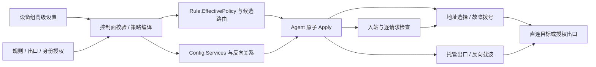
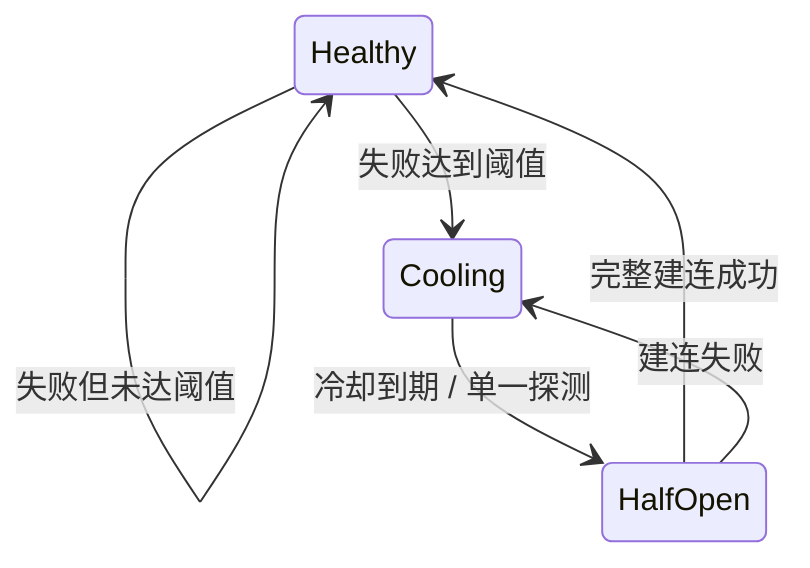
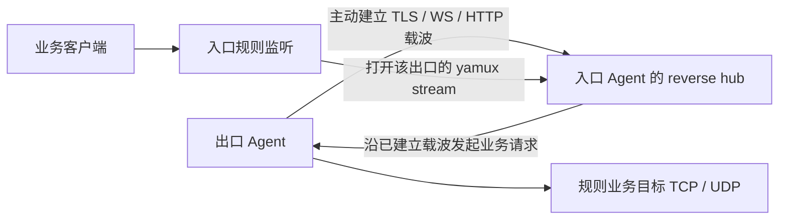

# 设备组高级设置完整技术实现方案

日期：2026-10-10。基线：v0.1.38 / `ee5ff3d29adb39fd5c7968863626a7da6eb833fa`。状态：用户已批准执行，P0–P4 已实施；P5 本地功能回归已完成，用户另行授权纳入 v0.1.39 提交、推送和发布。Linux 与多数据库功能回归由发布 CI 执行，Linux 跨机性能验收仍待执行。实现、部署与验证范围见 [实施交付说明](advanced-settings-implementation.md)。

## 1. 结论与实现目标

推荐采用 **控制面编译有效策略 + Agent 执行策略 + 节点托管隧道服务** 的方案。

14 个参数不能通过补几个界面开关完成。需要补齐三类能力：入站识别与过滤、地址与故障路由、反向载波的配置与生命周期。所有功能都以“实际连接和报文行为改变”为验收标准，API 保存成功和 Agent ACK 只是过程证据。

已有能力继续复用：TCP/UDP 转发、QUIC DATAGRAM、有限额度租约、TLS/WS/HTTP 隧道、SNI 共享端口、后端权重调度和 yamux 反向连接。产品仍由管理员在设备组高级设置中管理策略，用户规则表单继续以 TCP/UDP 和出口选择确定路径。

本文的推荐语义不是对参考面板底层实现的断言。现有仓库资料只证明字段和界面含义；`ipv6_group` 的精确选择范围、`tls_simple` 与 `tls` 的差异、TLS 对象子字段和数值零的行为缺少完整协议证据。以下给出本项目可以实现、测试和维护的定义，需要随本方案一起评审。

### 执行前缺口（v0.1.38）

| 层次 | 现有代码 | 要补的能力 |
| --- | --- | --- |
| 配置输入 | `web/src/core/groupAdvanced.ts`、`GroupAdvanced.vue`、`GroupAdvanced` | 参数作用域、明确默认值、TLS 子字段与执行状态 |
| 校验与保存 | `internal/platform/resources.go` | 匹配语法、引用授权、配置版本与依赖校验 |
| 下发 | `internal/platform/agents.go` | 编译后的入站策略、地址策略、故障候选与服务配置 |
| 连接执行 | `internal/agent/runtime.go`、`udp.go` | 可回放嗅探、逐请求过滤、统一拨号和故障状态机 |
| 隧道服务 | `internal/tunnel`、`cmd/agent/main.go` | 动态服务管理、反向接入端点、逐身份授权和状态上报 |
| 兼容与计量 | 能力标识、租约、WAL、配置比较 | 旧节点不可静默绕过，新策略不能改变费用或重复记账 |

## 2. 14 个参数的推荐运行语义

| 参数 | 推荐定义 | 实际执行位置 | 关键验收 |
| --- | --- | --- | --- |
| `allowed_host` | HTTP Host / TLS SNI 允许列表；没有可用 Host/SNI 时不匹配 | 入口 TCP 检查器；必要时出口独立检查 | 未列出的 Host/SNI 确实到不了目标 |
| `blocked_host` | HTTP Host / TLS SNI 拒绝列表 | 同上 | 名称、大小写、端口、尾随点和域名边界测试 |
| `blocked_path` | 每个明文 HTTP 请求的 Path 拒绝列表 | HTTP/1 请求边界过滤器、明文 HTTP/2 帧过滤器 | 同连接第二个请求、分块正文后的请求不能绕过 |
| `blocked_protocol` | `http`、`socks` 的识别与拦截；检测的是业务流量 | 原始入站；出口解封装后的业务侧 | HTTP/1、明文 HTTP/2、SOCKS4/5；不误屏蔽 HTTP/WS 隧道外壳 |
| `tls_inbound_policy` | 0 允许普通规则；1 只允许 TLS 入站；2 只允许 TLS，独立端口限管理员，共享规则仍遵守已有账号授权 | 控制面规则权限检查 + TCP ClientHello 检查 | 明文被拒绝；普通用户无法创建独立端口 |
| `tls_reject_empty_sni` | TLS ClientHello 缺少有效 SNI 时关闭连接；不单独禁止普通明文 | TLS 检查器 | 空 SNI 被拒绝，有效 SNI 可以通过 |
| `disable_udp` | 禁用该组入口 UDP 和使用该组出口的 UDP | 控制面筛选 + Agent 撤销监听/服务授权 | 已有流量停止、新规则拒绝、关闭后恢复 |
| `udp_over_tcp` | UDP 业务通过已授权 TCP 载波到出口；没有出口的直连保持原生 UDP | 路由编译器 + UDP session 创建 | 目标仍收 UDP，入口到出口实际出现 TCP 连接 |
| `ipv6_group` | 对端属于所列设备组时，连接其双栈端点优先 IPv6 | 执行该跳连接的 Agent/出口拨号器 | 实际 IPv6 socket、失败回退；不改变出口授权和倍率 |
| `max_fail` | 对候选连续连接失败的摘除阈值；0 表示首次失败立即摘除 | 新连接路由状态机 | 阈值前后、成功清零、多候选隔离 |
| `fail_timout_sec` | 摘除后的冷却秒数；0 不保留冷却，仍受最小探测间隔保护 | 故障状态机 | 冷却内不选、到期半开探测、恢复 |
| `reverse_group` | 出口组列出允许接受其主动反向连接的入口组 | 控制面关系编译 + hub/connector 管理 | 出口主动连入口，入口请求沿该载波到出口目标 |
| `protocol` | 反向载波的 `tls` / `tls_simple` / `ws` / `http` | 两端载波协商与 adapter | 每种协议真实建连、鉴权、业务转发和重连 |
| `tls` | 反向载波的受控 TLS 配置对象 | 两端服务管理与 TLS 配置构建 | SNI、CA、版本、ALPN 和凭据配置确实作用于握手 |

`tls_inbound_policy=2` 必须结合当前共享规则约束解释：现有母子规则要求同账号、同组、同节点、同监听地址。因此本方案保留该约束，管理员可持有独立母规则及其同账号子规则，普通用户创建独立母规则直接拒绝。切换前已存在的普通用户共享母规则也不能继续持有独立端口；依赖它的子规则一起停止并显示原因。若产品要求普通用户挂载管理员母端口，必须新增管理员端口授权资源、可使用身份组和独立 SNI 所有权校验，并按每个子规则的用户计量；不能仅删除同账号校验。该扩展不作为本方案的隐含权限放宽。

### 作用域与不可见内容

* Host/SNI、Path 和 TLS 入站策略针对 TCP。UDP 中的 QUIC/HTTP3、DTLS、ECH 内层 SNI、HTTPS Path 属于加密内容，无法靠 TCP 首包嗅探可靠获取。实现这 14 个参数不等于实现完整加密 DPI。
* `tls_inbound_policy=1/2` 的入口组只激活 TCP TLS 入站规则，UDP 规则不激活并显示 `tls_inbound_requires_tcp`。UDP over TCP 的外层载波加密不等于客户端 UDP 入站具有 TLS，不能因此绕过该限制。单独配置 Host/Path 时，TCP 执行相应策略，UDP 显示该策略不适用。
* `blocked_protocol` 的 UDP 行为保留当前首部匹配作为兼容策略，并在界面注明“数据报首部识别”。不把它宣称为 SOCKS UDP relay 或 HTTP3 全协议检测。无识别策略时原生 UDP 快速路径不增加解析工作。
* 明文 HTTP/2 可以读取 HPACK 的 `:authority` 和 `:path`；TLS 内的 HTTP/2 不解密，Host 策略检查可见 SNI。`blocked_protocol=http` 对明文 HTTP/1、h2c 实施阻断；TLS ClientHello 中明确出现 HTTP ALPN 的连接采用保守阻断并提示该检测方式。ALPN 缺失或被隐藏时不承诺识别 HTTPS 应用。
* `tls_reject_empty_sni` 遇到 ECH 时只能看到外层名称。`allowed_host` 不把未知内层名称当作命中；若要严格禁止 ECH，需要新增显式策略，不能把外层 SNI 检查称为已验证内层域名。
* `udp_over_tcp` 在入口直连没有远端解封装服务可用时，显示“不适用于直连”并保持原生 UDP。它在带出口的规则上完整执行。不存在通用方法能让只监听 UDP 的业务目标自动接收 TCP。如果需要直连使用 TCP 承载，必须配置远端解封装端点，这在架构上已经是出口。
* `ipv6_group` 不自动把规则改到另一设备组。它控制“连谁时优先哪种地址族”；IPv6 出口不能越过原规则授权。直连时仅对能明确关联到该组的目标端点执行组优先策略，外部业务目标无组关联时使用默认双栈拨号，并显示“不适用”。
* `protocol` 和 `tls` 可以预配置；只有相关反向关系激活时显示“生效”。其他场景显示“未使用”，不能显示执行成功。

## 3. 系统结构与数据流



编译器输出 Agent 可以直接执行的配置。Agent 不查询设备组数据库，不用原始组 ID 自行寻找未授权节点。关系编译、计费倍率和权限由控制面完成，DNS 和 socket 拨号由真正发送这一跳流量的节点完成。

### 有效策略的推荐结构

以下保留审批时的设计骨架；已实现的 wire 类型以 `internal/contract/group_policy.go` 为准，地址优先使用 `EffectivePolicy.PreferIPv6`，候选携带完整有效策略和倍率。

```go
type EffectivePolicy struct {
    Version       int              `json:"version"`
    InboundLayers []InboundPolicy  `json:"inbound_layers,omitempty"`
    Dial          DialPolicy       `json:"dial"`
    Failover      FailoverPolicy   `json:"failover"`
    Sources       []PolicySource   `json:"sources,omitempty"`
    Hash          string           `json:"hash"`
}

type InboundPolicy struct {
    GroupID        string   `json:"group_id"`
    AllowedHosts   []string `json:"allowed_hosts,omitempty"`
    BlockedHosts   []string `json:"blocked_hosts,omitempty"`
    BlockedPaths   []string `json:"blocked_paths,omitempty"`
    BlockedApps    []string `json:"blocked_apps,omitempty"`
    TLSRequired    bool     `json:"tls_required,omitempty"`
    RejectEmptySNI bool     `json:"reject_empty_sni,omitempty"`
}

type FailoverPolicy struct {
    MaxFail    int `json:"max_fail"`
    CooldownSec int `json:"cooldown_sec"`
}

type RouteCandidate struct {
    ID               string         `json:"id"`
    ExitGroupID      string         `json:"exit_group_id,omitempty"`
    PeerGroupID      string         `json:"peer_group_id,omitempty"`
    Target           string         `json:"target"`
    Transport        string         `json:"transport"`
    Tunnel           *Tunnel        `json:"tunnel,omitempty"`
    PreferIPv6       bool           `json:"prefer_ipv6,omitempty"`
    PolicyHash       string         `json:"policy_hash"`
    BillingMultiplier string        `json:"billing_multiplier"`
}
```

在 `Rule` 增加可选 `EffectivePolicy` 和 `RouteCandidates`，在 `Config` 增加可选 `Services`。实际类型还应包含权重、服务身份、到期时间和本地 profile 引用。输入校验、编译器和 Agent 都使用同一套匹配语法与类型约束。

`Hash` 只由规范化的执行策略生成，不对外提供包含秘密凭据的完整配置哈希。凭据变化使用单独的代次控制。有效策略与关系都有到期约束；断开面板后服务不能无限使用过期授权，恢复状态时必须重新验证配置有效期和本地 profile。

对用户规则 API 输入/输出使用专门 DTO，不允许用户提交服务端生成的有效策略、管理员资格或候选凭据。现有接口解码整个 `contract.Rule`，仅添加字段会扩大可提交范围，必须同步拒绝这些字段。完整候选凭据只给分配的 Agent；用户诊断接口返回脱敏的摘要。

### 缺省与显式零

当前 `GroupAdvanced.MaxFail`、`FailTimeoutSec` 是非指针整数，序列化总会生成零，无法区分“没配置”与“显式零”。因此：

1. 新版本输入使用可选整数或自定义 JSON presence 记录；新策略版本缺省为 3/30，显式零按上表解释。
2. 保留公开字段名 `fail_timout_sec`，API 和 UI 都可接受 `fail_timeout_sec` 别名；两者不同则拒绝，存储只保留前者。
3. 旧数据库里已经序列化的零保留，不能推断用户原意；迁移时列出影响并预览有效值。对 `advanced` 完全缺失的旧组保留旧规则级后端行为，直至管理员激活新策略版本。
4. 新增策略版本、更新时间和生效预览；不能在升级中无提示地启动此前只保存的黑名单或改变故障阈值。

## 4. 控制面编译、继承与热更新

新增 `internal/platform/group_policy_compile.go`，纯规范化/匹配器放在共享包，例如 `internal/policy`。编译函数接受规则、相关组、用户角色、授权候选与节点能力，输出有效策略和明确错误码。

编译发生在现有 `/agent/config` 的一致性快照中。写入、租约刷新与出口重新解析继续使用写事务，读取配置不得加入 DNS/网络探测，避免数据库锁被网络超时占用。

### 策略合并

* 管理员的入口组策略、出口组策略和链式组策略都不能被用户规则放宽。应用协议拒绝集合取并集；规则自身的拒绝项只能增加。
* 每个组内部仍禁止 `allowed_host` 与 Host/Path/应用协议黑名单同时配置，保留当前契约。不同组的策略使用分层检查，不能把允许列表简单拼接。两个允许列表是同时满足，即交集；任一拒绝条件命中即拒绝。
* TLS-only 使用最严格值；任一有关入口层要求管理员独立端口时，控制面必须验证规则的真实所有者与端口关系。管理员标志不能来自客户端输入。出口组只检查实际进入该出口的业务，不接管入口端口所有权。
* `disable_udp`、`udp_over_tcp` 结合整条已授权路径检查；冲突或无可执行载波必须显示原因，不选择不同路径绕过。
* 入口阶段执行该候选整条路径的策略，使出口组的限制在目标业务连接前生效。不同候选的路径策略可能不同，候选关联独立策略哈希；选中候选后执行它的策略，不能切换到备用出口时忘记重新评估。出口仍执行自身策略，不能信任客户端自报的“已检查”标志。
* `max_fail`、`fail_timout_sec` 对入口主动建立的直连/出口候选使用入口组值；出口主动建立下一跳连接时使用出口组值。不要对数字做取最小、取最大等隐式合并。
* 应用屏蔽针对隧道解封装后的业务内容。出口外层 HTTP CONNECT、WebSocket 和 TLS 本身不能因屏蔽 `http` 被禁止。

### 组依赖与版本发布

维护或事务内查询组→规则、出口组→入口规则、反向组→hub/connector 的依赖。修改出口组或反向引用组时，受影响的入口节点和出口节点都必须增加 `desired_version`。目前保存设备组只更新直接组成员，这是不能只改入口编译器就完成热更新的原因。

策略哈希使用规范化内容，避免数组顺序、JSON map 顺序造成无效重启；有顺序含义的列表保留顺序。`sameForwardingRule`、`sameRoutes` 和新服务配置比较都要覆盖策略哈希与身份代次，租约续期仍不算策略变化。

Agent Apply 先校验、编译匹配器、验证本地服务 profile 和预绑定新端口，全部成功才持久化并切换。策略收紧后关闭受影响旧连接和 UDP session，避免旧连接继续绕过；只换租约不关闭连接。无效 Apply 保留上一份已生效配置并上报失败。

能力不足时采用确定行为：编译器记录该规则的 `required_capability_missing`，配置中撤销该规则，配套 `BlockedRules` 诊断解释原因；其他兼容规则继续运行。升级后重新下发。不能仅返回配置 HTTP 错误让旧 Agent 一直保留可能违反新策略的监听。

## 5. 入站检查：Host、SNI、应用协议、TLS 策略

新增 `internal/agent/inbound_inspector.go`，返回分类、SNI/Host、已读数据的 replay connection 与拒绝原因。

### 检查顺序

```text
连接容量/资源槽位
  → 接收并验证 Proxy Protocol
  → 有界读取、协议分类、可选 ClientHello 解析
  → 共享 TLS 选择规则
  → 执行有效入站策略
  → 获取可用租约
  → 选择后端/出口并建立连接
  → 按需要启用 HTTP 逐请求过滤
  → 计费与 Relay
```

共享 TLS 和新策略共用一次 ClientHello 解析；必须检查 `receiveProxy` 返回的业务连接，不能重新从原始 `c` 读取。现有共享 TLS 函数对空 SNI总是拒绝，新通用解析器应区分“合法 TLS 但无 SNI”和“非法 TLS”；只有共享路由或拒绝空 SNI策略要求时才拒绝前者。

解析借助现有标准库 TLS ClientHello 回调捕获信息，但仅捕获而不向客户端发送握手字节。解析后的原始数据完整回放，目标继续完成真实 TLS 握手，入口不终止业务 TLS。不能通过更改客户端 SNI来满足允许列表。

### Host 匹配规则

采用精确名称和 `*.example.com` 两种语法；通配符只匹配一个或多个子域标签，不匹配裸域，也不匹配 `evilexample.com`。规范化使用 IDNA Lookup、ASCII 小写、合法端口剥离和单个末尾根点剥离；IP Host 使用 `netip`。多 Host、非法端口、异常字符和解析不一致按畸形请求拒绝。

HTTP/1 检查每个请求的 Host；absolute-form 请求的 authority 与 Host 不同则拒绝。明文 HTTP/2 检查每个请求头块的 `:authority`；与 Host 同时出现且不一致则拒绝。TLS 透传只检查 ClientHello 的可见 SNI；解析不到名称的未知流量不命中允许列表，单独黑名单不把全部未知协议封禁。

### 应用识别与资源边界

识别 HTTP/1 请求行、明文 HTTP/2 前言、SOCKS4/4a 和 SOCKS5 握手。增量识别分片前缀，不能读不到第 8 字节就当成未知放行；分类明确后立即停止读取。兼容 TLS ALPN 的保守 HTTP 拒绝模式必须单独标识，避免暗示已解密 HTTPS。

初始建议：嗅探上限 64 KiB、检查期限 5 秒、HTTP 单头块 32 KiB、每连接一个检查器，均由系统配置提供上限而非开放任意 JSON。无嗅探策略、无共享 SNI 的规则直接进入现有转发快速路径。服务器先发数据协议只在明确需要客户端元数据时等待，否则不能因为新增设置模块普遍延迟连接。

TLS、SOCKS 和可解析的 HTTP/1 初始拒绝发生在目标 dial 之前，不产生目标连接或业务计费。已有 HTTP 连接后续请求被拒绝时，只丢弃该请求及后续数据，之前已通过的业务仍照实计费。明文 HTTP/2 为完成必要的 SETTINGS 交互可能先建立目标连接，但被拒绝的请求头不能发给目标；不能把目标已有 socket 当成拒绝策略失效，也不能只测 socket 数而不测请求是否到达。

出口的现有 `serveRequest` 会先连接目标再发 `readyFrame`，因此也需要改造。对需要出口独立初始检查的新数据面版本，引入“已鉴权、等待检查”的 accepted 阶段：入口收到 accepted 后发送有界 inspection frame，携带预读前缀；出口检查通过后才拨号并发送 ready，随后进入普通 Relay。inspection frame 作为检查元数据不写入目标、不计业务字节；正常 Relay 回放原始前缀时，入口先按现有 WAL/额度机制计费，出口验证其与被检查前缀一致，再向目标转发一次。禁止出口在入口完成计量之前自行把检查副本写给目标。等待期间使用固定超时/容量上限，错误时关闭；两端必须声明该握手能力，否则可能造成入口等 ready、出口等首包的死锁。后续 HTTP 请求继续使用流过滤器，HTTP/2 走上一段的 SETTINGS 例外，不等待不可取得的元数据。检查元数据复制开销只发生在启用独立出口检查的初始阶段，不能加入每个 UDP 报文路径。

## 6. HTTP Path 与 Host 必须逐请求检查

只检查首包会漏掉 HTTP keep-alive、pipeline、HTTP/2 并发流中的后续请求。这一部分需要有状态的流过滤器，不能只扩展现有 `blocked(prefix)`。

### HTTP/1

使用有界缓冲收集完整请求头，解析和校验后再原样转发该请求头；不重新序列化 HTTP 请求。根据合法 Content-Length 或 chunked framing 流式转发正文，不完整缓存正文，不误把正文里的 `GET` 当成下一次请求。检查每个请求的 Host 和 Path；拒绝重复/冲突 Content-Length、CL/TE 歧义、错误 chunk 与超大 trailers，避免请求边界与目标解释不同。

Path 模式使用锚定 glob，明确 `*` 可跨 `/`、`?` 匹配一个字符、其他字符按字面量；可用有界自动机，避免回溯正则。输入必须以 `/` 开头。比较 raw path 与单次解码后的规范路径，任一匹配即拒绝；不依赖目标服务器再次解码。覆盖 `/private`、`/private/*`、编码斜线、点段、重复斜线、双重编码测试。不同业务服务器解码规则仍可能不同，严格模式拒绝残留歧义编码，而不是声称通用解码能覆盖所有回源实现。

CONNECT 或协议升级后内部路径不可继续检查。启用 Path 策略时默认拒绝 CONNECT 与 HTTP/1 Upgrade；其他规则允许升级后进入普通 Relay。不能在有路径黑名单时无提示放开 opaque 隧道。

### 明文 HTTP/2

借助 `golang.org/x/net/http2` 的帧解析与 `hpack` 解码，维护每连接的 HPACK 动态表和 HeaderBlock 状态。完整 HEADERS/CONTINUATION 头块检查 `:authority`、`:path` 后才转发；DATA 按流转发，不解码正文。严格限制头块大小、动态表大小、并发流数，处理 SETTINGS、trailers、padding 和错误帧。

最初可采用“任一请求违反策略则关闭整个连接”的确定行为，避免删除某个流帧引发流控与 HPACK 状态不同步。被拒绝的请求头不能先转发再检查。若后续需要只关闭违规流，应独立设计 HTTP/2 代理与双向流控，不直接丢帧。

HTTPS 的 Path 无法读取，界面必须显示“仅明文 HTTP 生效”。要检查 HTTPS Path 需要持有业务证书并终止 TLS，属于另一个功能设计；本方案不把反向隧道证书误用为业务 MITM 证书。

## 7. UDP 策略与原生性能路径

保留 `udp-credit-v1`、`udp-datagram-v1` 和 `lease-set-v1` 的额度窗口、DATAGRAM 与续租机制。没有额外 UDP 策略时，worker 不新增 DNS、磁盘、逐包 JSON 或全局锁。策略和地址解析在 Apply 或 session 创建时完成，有限的首部拒绝检测才在数据报路径执行。

`disable_udp` 在保存新规则时检查、配置编译时检查，Agent 在收到撤销时关闭监听、释放 session 与资源槽位。出口组策略应同时阻止对应业务打开，不能只隐藏控制面列表。

`udp_over_tcp` 只改变入口到出口的载波，出口到业务目标仍是 UDP。复用现有长度帧协议，保留空报文、报文边界、最大长度和每对端 session 隔离；策略切换后旧 session 关闭，避免同一流混用 QUIC 与 TCP。

不要在 `false` 时静默将 QUIC 降到 TCP。是否允许兼容回退继续使用已有 `AllowTCPFallback`；网络封锁、能力缺失与管理员强制 TCP 要显示不同原因。反向与链式 UDP 当前走已有流载波，界面标明 UDP over TCP；若要求这些路径也达到原生 UDP性能，需要另一个 QUIC 反向/链式 DATAGRAM 设计，不以现有开关冒充已实现。

验收应数 TCP Accept 或抓取载波类型，并检查目标实际收到的是 UDP；QUIC 会话成功不能单独证明业务报文已到达。

## 8. IPv6 对端优先设备组

推荐解释为“连接所列设备组对端时优先 IPv6”。不把 `ipv6_group` 当成额外出口授权或不同计费路线，避免用户被切到未购买线路。

1. 编译器从已授权规则路径确认 `PeerGroupID`，若存在于 `ipv6_group`，生成该跳 `PreferIPv6=true`。域名端点执行 A/AAAA；IPv4 literal 无法凭空转换为 IPv6，需要节点登记可用双栈端点。探针公网 IP 只用于候选提示，不能自动把所有探针地址当成开放服务端点。
2. 拨号器在实际执行这一跳的节点解析端点，保留 DNS 本地性。入口连接出口端点时入口解析，出口连接最终业务目标时出口解析。不要让面板 DNS 结果替代节点 DNS。
3. TCP 采用 IPv6 优先的 Happy Eyeballs，建议 250 ms 后启动 IPv4竞争，取消未选连接。TLS/WS/HTTP 对 socket 使用同一拨号策略，证书校验和 SNI仍使用原主机名，不改成候选 IP。Mux 和 QUIC pool key 包含地址策略，避免复用旧 IPv4连接冒充已优先 IPv6。
4. QUIC 端点地址族失败可按合法连接握手错误回退。直接 UDP没有握手，`Dial("udp")` 成功不证明 IPv6可达；只对明确网络错误或管理员配置的专用探测回退，不能重发用户数据来检测路径，否则会重复执行业务。
5. 将实际地址族、解析候选、选择原因和回退错误写入诊断。没有组关联或端点只有 IPv4时标明原因，不能显示“已走 IPv6”。

组 ID 引用在保存时检查存在、所有权与适用类型；旧配置的未解析 ID可以保留作迁移信息，但激活新策略必须修正或明确标记不可用。

## 9. 故障转移：失败计数、冷却与恢复

扩展 `internal/agent/failover.go`，保持原有加权选择，替换 `failed bool` 和固定 10 秒恢复为状态机：



建议状态键为 `(ruleID, candidateID, policyGeneration)`，保留权重调度的 `current`，新增连续失败计数、冷却截止时间、单一探测标记。所有网络操作在锁外执行，状态变化在短临界区提交。Inject clock 进行确定性测试，不依赖真实长时间 sleep。

* 有其他候选时，同一次新连接失败可尝试它们；阈值决定是否在后续连接中摘除失败候选，不能解释成一定要让用户先失败三次才允许尝试健康候选。
* `max_fail=3` 在第三次连续失败时摘除；0 等效首次失败立即摘除。`fail_timout_sec=0` 不维持长冷却，但探测频率至少间隔 1 秒，禁止忙循环。只使用这些值明确控制行为，不继续藏固定 10 秒逻辑。
* 只有连接建立错误、握手/鉴权错误、明确的目标连接失败能影响状态。额度耗尽、用户被禁、配置过期和策略拒绝不能误判出口故障，不能靠换出口绕过它们。
* 一旦业务字节已经发送，不能把 TCP 连接自动重播到另一目标；已有流失败后结束，新连接再择路。UDP不重发已交付数据报；无回包本身不是通用故障信号。
* 所有候选失败时返回明确 `all_candidates_unavailable`；冷却候选只允许一个半开探测。探测走相同 TLS、鉴权和目标建立流程，远端专用健康探测要配置能力，不能给任意业务端口发送探测数据。
* 直连只有一个目标且没有 `backends` 时，只能摘除与重试，不能凭故障参数创造备用目标；界面显示“单目标，无可切换后端”。有多个 `backends` 时正常切换。

### 出口候选与计费

当前 `resolveExitWithUDP` 选出一个出口并更新 `BillingMultiplier`，`refreshExits` 改路由时会清租约。改为下发多候选后必须保留这些计量约束：

* 本地切换只允许同授权出口组、同有效计费倍率的候选，复用该规则现有额度和计量键；记录实际 candidate ID用于运维诊断。
* 不同倍率或不同权益的候选需要控制面重新授权、结算旧预留额度、分配新租约，再发布新版本，不能直接带着旧 lease 切换。
* 候选凭据只下发给分配节点，受配置有效期与身份代次约束。退租、禁用、删除、离线撤销和管理员选择固定出口时都同步更新候选。
* 候选元数据排序变化不要迫使健康长连接关闭；授权撤销、策略收紧、凭据变化必须关闭受影响流。需拆分“当前转发变化”与“候选集合更新”的配置比较。

## 10. 反向隧道：组引用、接收端和主动连接

当前 `RunReverse`/`openReverse` 已使用 yamux，出口可主动建立载波，然后入口侧打开 stream 去请求出口连接目标。但 `-mode exit` / `reverse-exit` 分支独立运行，不接收普通 Agent `/agent/config`。只新增 `Rule.Reverse` 无法让已部署出口自动修改反向策略。

因此这一部分要新增托管服务机制，而非生成任意远程 shell 命令。

### 拓扑与组含义

推荐在出口设备组配置 `reverse_group=[入口组ID...]`：出口节点主动连接这些入口组指定的 reverse hub，入口规则仍明确选择其出口组。hub 只是载波接收端，不是面板 HTTP 服务，也不使用面板登录端口传业务流。



每个入口 hub 必须具备明确的公网/可达端点、监听端口、节点 ID、证书 profile 与授权身份。增加管理员 reverse-hub 资源或扩展已有出口资源为明确的 hub 角色；复用 `cp_ports` 做物理端口预留，不能由 `reverse_group` 猜测任意端口。

### Agent 服务管理

新增 `Config.Services`，包含 hub listener、出口 listener 和 reverse connector 的类型化配置；新增 `ServiceManager` 协调服务的启动、健康状态、热更新、取消和关闭。普通 Agent 同时运行转发 runtime 与受控服务，保留旧 CLI 模式作为兼容部署路径。

本地安装提供 profile 文件，登记允许绑定的地址/端口范围、证书和 CA标签。控制面只能引用标签，不能下发可执行命令或任意本地文件路径；私钥留在节点。改接入脚本使 Debian/Ubuntu、RHEL 系和 Arch 的 systemd 部署加载同一 profile 与服务配置。兼容旧出口进程时显式迁移，避免新旧进程抢占监听端口。

hub/connector 配置分发到不同节点，应采用先准备接收端、确认 ready、再启动 connector 的发布顺序。控制面维护期望关系及状态，不声称跨节点 Apply 是原子事务；只有两端 ready 才激活使用该反向路线的新业务。

### 鉴权、重连和在线状态

当前 hub 使用单一 `Server.Token` 和 `ReverseAllowed`，不足以承载多个设备组独立授权。改成逐反向关系身份凭据：`connectorNodeID + hubID + generation + token + expiresAt`；token 摘要映射到被授权关系，握手要求该身份被允许，每个业务 stream 再验证规则/目标授权。

不能把所有出口共享一个全局 token。需要分开载波鉴权和业务 stream 凭据，避免 hub 到 connector 时错误复用入口请求 token。扩展数据面 openRequest 的版本与身份字段，并门控新能力；旧版本继续按旧部署限制运行。

connector 采用带抖动指数退避，例如 1 秒起步、最大 30 秒，配置撤销/进程退出立即取消；hub ready、connector ready、会话数、上次错误、代次状态通过 Agent独立状态上报。节点心跳在线不等于反向载波可用。

### `protocol` 的四种载波

| 输入值 | 推荐协议定义 | 复用/新增工作 |
| --- | --- | --- |
| `tls` | TCP → TLS → TFP 反向身份握手 → yamux → 业务 stream | 复用现有 TLS与反向会话，支持共享 hub 分发身份 |
| `tls_simple` | 专用端点的简化 TLS载波；每个端点只承载一个授权关系，业务仍使用 yamux | 新增显式 adapter 和能力；不宣称兼容未知参考线协议 |
| `ws` | HTTP WebSocket Upgrade → 内层 TLS → 身份握手 → yamux | 复用当前 `ws` 内层 TLS行为，客户端/服务端共用路径与大小限制 |
| `http` | HTTP CONNECT → 内层 TLS → 身份握手 → yamux | 复用当前 CONNECT行为，严格限制请求头与端点 |

`tls_simple` 不能定义为“取消 yamux”然后继续调用 `RunReverse`，因为接收端需要沿同一主动载波反向打开多个业务 stream。推荐为专用端点模式；可复用 TLS framing 和 TLS会话恢复，减少分发配置，不声称零复用开销。如果未来要实现无 yamux 的一请求一载波协议，需要独立连接池和反向请求调度设计。

### `tls` 对象白名单

已支持的结构：

```json
{
  "enabled": true,
  "server_name": "reverse.example.com",
  "min_version": "1.3",
  "alpn": ["tfp-reverse-v1"],
  "ca_profile": "system-and-private",
  "certificate_profile": "reverse-listener",
  "client_certificate_profile": "reverse-client"
}
```

空对象使用安全默认值；`enabled=false` 明确表示不激活反向服务并显示“已禁用”，不表示降为无加密载波。`min_version` 第一版只支持 TLS1.3；ALPN 必须与该 adapter 允许值一致；`server_name` 参与真实证书校验。server certificate 和可选 client certificate 通过本地 profile 加载；双方选择 mTLS 时必须对齐，不能单侧悄悄忽略。

旧版本任意保存的嵌套 JSON在迁移中保留并标记未解释，激活前必须修正未知字段，禁止“保存了但没用”。不接受 `insecure_skip_verify`、任意 callback、私钥正文或任意文件路径。

## 11. 能力门控、迁移与可观测性

推荐新增能力：`group-policy-v2`、`inbound-inspection-v1`、`http-stream-filter-v1`、`peer-address-policy-v1`、`route-failover-v1`、`managed-services-v1`、`reverse-group-v1` 和 `reverse:tls_simple`。只在实现和本地自检完成后声明相应能力，不能一次把所有标识加进字符串列表就算支持。

升级顺序：先新增兼容契约与诊断，再升级 Agent和出口，最后激活高级策略。当前未生效的存量设置不能随部署无提示突然拦流；提供激活预览，列出受影响规则、节点能力、实际作用域和所需服务资源。用户的 TCP/UDP 选择和出口授权仍由现有规则决定。

运行状态区分“已保存”“待下发”“节点不支持”“等待对端”“已应用”“无适用规则”“运行失败”。保存提示只说明保存；`applied_version` 和 policy hash 对上以后才能显示已应用，反向关系还必须看服务 ready。

扩展已有规则诊断，返回脱敏的有效策略来源、版本、实际候选、地址族、载波类型、能力缺失和策略拒绝原因。计数器在内存聚合后随状态上报，不把每次拒绝写入计费 WAL或 SQL。日志不得包含 Tunnel token、私钥和完整 HTTP敏感头部。

应用级拒绝是规则策略，初始被拒业务不计费；已转发业务维持现有字节口径。hub和出口服务不重复扣入口权益；健康探测与载波心跳独立记录，不充当业务计量。

## 12. 实施顺序与代码改动指引

| 阶段 | 主要改动 | 覆盖参数 | 完成条件 |
| --- | --- | --- | --- |
| P0 语义与契约 | 可选值、策略版本、EffectivePolicy、DTO、能力与诊断；旧配置激活预览 | 全部公共语义 | 编译输出确定、权限/作用域和零值测试通过 |
| P1 入站执行 | 共享解析器、Host/SNI/TLS检查、HTTP/1逐请求、h2c过滤、协议识别 | 前六项 | 禁止报文确实不进入目标；分片/后续请求不能绕过 |
| P2 UDP与地址 | 入口/出口依赖发布、UDP传输选择、统一拨号、双栈候选 | `disable_udp`、`udp_over_tcp`、`ipv6_group` | TCP/UDP实际 socket和回退证据；原生 UDP无策略时保持快速路径 |
| P3 故障转移 | RouteCandidates、权重状态机、冷却/半开、计费约束 | `max_fail`、`fail_timout_sec` | 阈值、切换、恢复、单目标和不同倍率限制测试通过 |
| P4 反向服务 | reverse-hub资源、ServiceManager、本地profile、关系鉴权、四 adapter | `reverse_group`、`protocol`、`tls` | 两端真实 Agent ready、真实反向业务、断线重连、证书错误拒绝 |
| P5 全量验收 | 三浏览器、Linux系统、跨机性能、状态/文档更新 | 全部 | 下表所有验收证据齐全才称“高级设置全部实现” |

主要文件路径：

* `internal/contract/types.go`、拟新增 `group_policy.go` / `services.go`：wire 类型、可选值、约束和能力。
* `internal/platform/resources.go`、`agents.go`、`group_types.go`、`exits.go`、`leases.go`、`shared_tls.go`：保存校验、编译、授权、依赖发布、候选/倍率与端口约束。
* 拟新增 `internal/policy`：Host和Path匹配、规范化及编译；Agent与控制面共享相同语法。
* `internal/agent/runtime.go`、`shared_tls.go`、`udp.go`、`failover.go`、`continuity.go`、`client.go`：执行、热更新、计量保持与状态上报。
* 拟新增 `internal/agent/inbound_inspector.go`、`http_filter.go`、`dial_policy.go`、`service_manager.go`：分别承接解析、逐请求检查、地址选择和服务生命周期。
* `internal/tunnel/tunnel.go`、`mux.go`、`datagram.go`、`chain.go`：逐跳策略、数据面版本、身份鉴权、地址族和反向adapter。
* `cmd/agent/main.go`、接入脚本与 systemd模板：合并托管服务启动、本地profile和旧模式迁移。
* `web/src/core/groupAdvanced.ts`、`GroupAdvanced.vue`、资源/规则诊断页：作用域、TLS子字段、激活预览与实际状态。`internal/openapi/generate/main.go`、OpenAPI和 API文档同步更新。

P2、P3、P4共享契约与路由编译器；P4还依赖服务与证书profile，不能作为几个字段映射的轻量补丁。每阶段独立提交和回归，全量实施必须完成所有阶段。

## 13. 验收计划与性能要求

### 功能证据

| 项目 | 必须覆盖的真实行为 |
| --- | --- |
| Host/SNI | 允许/拒绝对、分片、空名称、IDN、通配符、大小写、末尾点、共享端口和Proxy Protocol |
| HTTP Path | 第二个请求、pipeline、正文/分块正文、trailer、absolute-form、编码路径、h2c多个stream、CONNECT/Upgrade |
| TLS policy | 明文拒绝、TLS透传原样回放、无SNI、普通用户独立端口拒绝、既有共享规则依赖撤销 |
| 协议屏蔽 | HTTP/1方法、h2c前言、SOCKS4/5、未知协议、外层HTTP/WS载波允许、ALPN检测边界 |
| UDP | 原生直连、QUIC出口、UDP-over-TCP、空报文/最大报文、已有session撤销、恢复；TCP业务不受UDP禁用影响 |
| IPv6 | 双栈端点实际socket、IPv6失败回退、证书仍验证域名、仅IPv4端点、UDP无握手限制、不跨组授权 |
| 故障转移 | 阈值和零值、成功清零、半开并发、冷却、全候选失败、单目标、已发送业务不重播、相同倍率与租约 |
| 反向服务 | 四种carrier、出口主动连接、错误身份/凭据/证书拒绝、hub故障、断线重连、轮换、删除组与跨组隔离 |
| 配置闭环 | 组修改→所有依赖节点新版本→实际行为改变；不支持节点撤销、非法Apply保留旧配置、租约续期不中断 |

把前一轮本地诊断中的“未生效观测”转为正式正向回归测试，建议写入 `internal/integration/group_advanced_runtime_test.go`。测试启动真实面板、临时数据库、入口/出口 Agent和目标socket；不能继续只用模拟节点心跳证明反向服务已经执行。

执行适当的 Go单元、集成和 race检查；控制面在 SQLite、PostgreSQL、MySQL各测试事务/依赖发布。浏览器复用 `scripts/test_webui_live.mjs` 验证表单、API回读、实际状态和冲突解释。Linux安装后覆盖 Debian/Ubuntu、RHEL 系、Arch；相同 socket逻辑使用 Go标准库，平台差异集中在服务与profile装载。

验收记录至少包含：源/生效版本、脱敏策略摘要、Agent/对端状态、真实目标连接和报文、计费字节。拒绝用例检查目标没有收到被拒报文；不只看客户端超时。UDP-over-TCP记录真实TCP Accept或抓包；IPv6记录真正连接地址；反向记录主动连接方向。

### 性能约束

未启用高级策略的直连与原生UDP使用现有快速路径，不能逐包写盘或加入解析锁。建议以同机同版本基线做性能预算：无策略吞吐/PPS下降不超过5%，CPU增加不超过5%；开启首包检查时报告建连P50/P95/P99；开启逐请求HTTP过滤时单独报告RPS、吞吐、延迟、缓冲上界。5%是拟定验收预算，需要重复采样和置信区间，不能用一次低速回显宣称达标。

复用 `cmd/udpbench` 与 `docs/udp-performance-plan.md` 的跨机吞吐/PPS/P99矩阵。严格HTTP策略可以增加处理成本，但不得影响未启用策略的其他规则；反向载波和状态探测不得锁住全节点数据路径。应做Linux跨机压力、内存/goroutine上界、连接耗尽和长时间运行测试。

## 14. 评审重点与最终完成标准

本方案推荐的关键选择是：IPv6列表控制对端地址族而不新增出口授权；故障零值采用立即摘除/无长期冷却；反向引用从出口组指向入口hub；`tls_simple` 为专用端点TLS反向模式；HTTPS路径保持可见性限制；不同倍率出口不能本地无租约切换。

这六项是产品语义与兼容选择，不能由开发者在实现过程中默默变更。若要求完全复刻参考面板线协议，需取得相应规范或受控两端抓包再替换协议定义；当前资料不足以声明协议完全兼容。

最终完成标准是：14个参数都具有明确的生效条件和真实执行链路；不适用或不可见内容显示具体原因；既有授权、租约、计费和原生UDP性能约束保留；全部允许/拒绝、修改/恢复、版本/能力和跨机服务场景具有可复跑证据。只有达到这些标准，产品才可以宣布高级设置功能完整可用。
