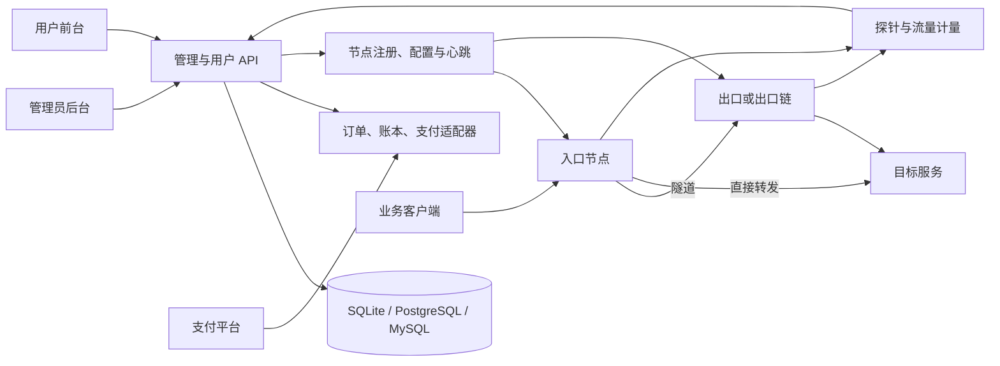

**流量转发面板产品需求基线 · v0.3 · 2026-09-20**

状态：用户已确认分阶段完整交付并授权实施。基础要求来自用户描述，功能补充来自 [ny 面板调研](research/ny-panel-observations-2026-09-20.md)；已确认的业务决定见 D01–D15，阶段与实现状态见 [动工计划](implementation-plan.md)。需求已纳入不等于实现或验收已通过。

产品包含管理员后台、用户前台、自有 Go Agent 和服务器探针。管理端负责配置与运营；节点执行转发、策略与计量；两端界面按权限查看数据。用户入口为 `/`，管理入口为 `/admin`，共用构建资产及 hash 路由，首版单控制面进程。

v0.3 保留 M01–M08、R01–R48，增加前端规范 M09 及 A33–A36。支付名单、四种加密承载、钱包购买、立即重置续费、计量、离线时限、规模与高级功能范围已锁定。Cyber 根据2026-09-21用户指示跳过；真实商户与服务器环境仍是外部依赖；容量目标仍需实测。

配套文档：[完整性复核与需求追踪](requirements-completeness-review.md)、[验收场景](acceptance-scenarios.md)。本文中的“建议”是供评审使用的设计口径，不等于用户已经确认；技术验证缺口与业务决定分开记录。

**用户已经明确的范围**

| 编号 | 要求 | 需要明确的验收口径 |
|---|---|---|
| M01 | 管理员后台与用户前台 | 路由和操作权限分离；普通用户只访问自身资源；接口同样执行权限检查 |
| M02 | 常见支付渠道，包含 EPay | 支付适配器可扩展；每个接入渠道单独通过创建订单、查单、回调、重复通知和失败场景验收 |
| M03 | TLS、WS、WSS、HTTP 隧道 | 协议矩阵明确 TCP/UDP、加密、鉴权、证书/SNI、Mux、反向连接与代理兼容情况；用实际传输验证 |
| M04 | 管理员和用户均可查看服务器探针 | 管理员全局视图，用户授权视图；隐藏和字段权限在服务端生效 |
| M05 | 实时带宽、真实公网 IP、硬件资源 | 指标带单位、采样时间与来源；区分 IP 类型和累计流量；缺失数据不误显示为零 |
| M06 | SQLite、PostgreSQL、MySQL | 内置库确定为 SQLite；三库通过相同核心业务与 500 节点规模验收，不降低 SQLite 容量目标 |
| M07 | 主要功能提供管理 API | 版本化文档、统一错误、分页筛选、权限、服务账号/API Token、限流和审计 |
| M08 | 添加设备组时可选择屏蔽协议 | 新增和编辑均提供控件；显示适用层级、识别能力与限制；验证配置确实下发并生效 |
| M09 | 两端 UI 遵循指定前端技术标准 | 依据原文件 `D:\Windows 10 Backup\桌面\WebUI-前端技术栈自述.md`；见 [项目内参考副本](reference/webui-standard.md) 与 [适配说明](webui-adaptation.md)，包含 Vue/TS/Vite、视觉、交互、自托管、Go 嵌入与质量门禁 |

WS 使用二进制 WebSocket 字节流内的标准 TLS；HTTP 使用 HTTP/1.1 CONNECT 内的标准 TLS；WSS 使用 WebSocket over TLS；TLS 使用直接 TLS 承载。四者都支持 TCP/UDP，校验证书与节点身份，禁止静默明文降级。

**建议补充的功能清单**

下表历史 P0/P1/P2 表示功能重要程度，与动工计划 P0–P6 的实施阶段不是同一编号。链式、反向、Mux、TLS 共享端口、邀请返佣和远程终端已纳入最终交付，分期不会移出范围。其余仍标注候选的 MFA、工单、额外直连支付等不自动纳入。

| 编号 | 功能 | 建议优先级 | 验收要点 |
|---|---|---|---|
| R01 | 登录、改密、封禁、会话失效 | P0 | 改密/封禁对会话和转发权限的影响明确；普通用户无法提升权限 |
| R02 | 用户组与节点授权 | P0 | 明确用户组、设备组、物理机器和仅用于整理的文件夹分组，验证入口/出口组合是否合法 |
| R03 | 节点注册、凭据轮换与版本能力 | P0 | 节点身份可撤销；能力不支持时拒绝配置；区分安装、更新、在线与配置同步状态 |
| R04 | 仅监控、入口、出口及入口直出 | P0 | 同一 Agent 可只监控；直出策略有禁止/可选/强制；端口冲突可定位 |
| R05 | 转发规则生命周期 | P0 | 创建、编辑、启停、删除、IPv4/IPv6/域名目标、配额校验和同步反馈 |
| R06 | 配置下发与节点确认 | P0 | 配置版本可追踪；失败可重试；节点离线和重连后结果一致，不能仅凭保存成功显示正常 |
| R07 | 端口与访问策略 | P0 | 多段端口范围、租户冲突、协议/域名/路径策略、允许与拒绝优先级、节点生效状态 |
| R08 | 流量统计与计费 | P0 | 字节、方向、倍率、周期、重置、重启、重传和重复上报口径明确；网卡流量与规则账单分开 |
| R09 | 用户与规则限制 | P0 | 流量、带宽、规则数量、IP 数、连接数和有效期可配置；定义分节点还是全局总额 |
| R10 | 套餐与权益发放 | P0 | 日付/月付/流量包、到期、续费、超额处置和套餐变更具有明确状态 |
| R11 | 订单、钱包与账本 | P0 | 精确金额、币种、状态机、重复扣款防护、支付与权益发放一致；账务可追溯 |
| R12 | 支付适配与对账 | P0 | 通道隔离、验签、金额校验、幂等、主动查单、补偿、费率展示；密钥不出现在用户接口 |
| R13 | 实时探针展示 | P0 | CPU/内存/磁盘/带宽/在线时间/负载/连接数；明确采样周期，断线显示陈旧状态并重连 |
| R14 | IP 来源与隐私控制 | P0 | IPv4/IPv6、NAT、多网卡、多出口、观察时间、管理员与用户字段权限 |
| R15 | API 与租户隔离 | P0 | 网页和 API 使用同一权限规则；普通账号横向/纵向越权测试通过 |
| R16 | 三种数据库与备份恢复 | P0 | 迁移可重复执行；金额/大整数/时间/唯一约束一致；备份可实际恢复 |
| R17 | 批量规则与分组 | P1 | 批量新增/修改/导入/导出/切换/启停有预览、冲突说明和逐项结果 |
| R18 | 负载均衡与故障转移 | P1 | 多目标、节点权重、健康检查、下线剔除、恢复与现有连接处置可验证 |
| R19 | 用户自带出口 | P1 | 用户安装自己的出口；与共享入口的授权、计费及可见范围一致 |
| R20 | 自动续费与可叠加流量包 | P1 | 提前续费、余额不足、并发续费、套餐隐藏/删除、剩余额度规则明确 |
| R21 | 兑换码 | P1 | 套餐绑定、折扣、次数、有效期、并发兑换与核销记录 |
| R22 | 人工记账、补单、退款 | P1 | 高权限操作有审计、幂等与原因；渠道能力不同要明确，避免只改订单展示状态 |
| R23 | 告警与通知 | P1 | 节点离线/恢复、额度与到期通知；宽限期、保留期、去重、订阅与通道策略 |
| R24 | 历史监控与统计 | P1 | 指标留存、聚合粒度、时间范围、排行；明确多节点和跨周期计量口径 |
| R25 | 诊断与 Looking Glass | P1 | 返回入口、出口和面板阶段结果；目标范围、频率和权限可配置 |
| R26 | 站点运营设置 | P1 | 注册策略、验证码、公告、品牌、主题、支付设置与配置缺省行为 |
| R27 | Proxy Protocol | P1 | 接受与发送分别配置，明确版本和 TCP/UDP 支持，错误配置可诊断 |
| R28 | 证书与隧道可靠性 | P0 基线 / P1 自动化 | TLS/WSS 首版即需要证书校验、SNI、过期处理和重连；自动签发续期属于可分期增强，不能把加密基线整体延后 |
| R29 | 邀请返佣 | P2 | 首次/循环、比例、退款回冲、佣金转余额和手动提现流程；规则不可由前端决定 |
| R30 | 链式出口、反向连接、Mux | P2 | 每跳能力、循环检测、最大跳数、链路故障、计费和加密边界可解释 |
| R31 | TLS 入站共享端口与 SNI 路由 | P2 | 母/子规则授权、端口所有权、空 SNI、证书与回源验证明确 |
| R32 | 远程终端与节点升级 | P2 | 独立运维权限、可审计命令/操作、升级失败恢复，不随普通探针权限开放 |
| R33 | 安装与首次初始化 | P0 | 内置数据库开箱可用；管理员引导、PG/MySQL 连接验证、配置检查、健康检查、安装/卸载及数据保留说明 |
| R34 | 账号恢复与管理员登录保护 | P0 基线 / P1 增强 | 不依赖已登录会话的账号恢复方式、登录限流、会话管理；MFA 和邮件自助找回作为明确候选 |
| R35 | 权限与机器调用身份 | P0 | 区分管理员、用户、服务账号、节点；API Token 有权限范围、到期和撤销；额外财务/运维角色为候选 |
| R36 | 物理机器端口资源管理 | P0 | 同一机器跨组、跨租户、IPv4/IPv6 和 TCP/UDP 的监听冲突、分配竞争、删除后释放可验证 |
| R37 | DNS、双栈与出站绑定 | P0 基线 / P1 高级 | 目标解析失败、地址更新、IPv4/IPv6 选择有确定行为；高级出站网卡/源地址绑定按能力开放 |
| R38 | 数据转发边界与资源控制 | P0 | TCP 半关闭、UDP 会话与报文边界、连接/空闲超时、背压和内存上限；不支持的组合不能静默降级 |
| R39 | 长任务与并发编辑 | P0 | 批量、升级、导出等返回任务进度和逐项结果；重复提交不重复执行；旧配置不能覆盖更新版本 |
| R40 | 面板不可用时的节点策略 | P0 | 区分面板失联与节点故障；有效配置、权益到期、配额及撤销延迟有明确上限和恢复流程 |
| R41 | 计量与账务边界 | P0 | 重复/乱序/延迟上报、月末与时区、倍率变更、精度和流量回绕均有确定归属 |
| R42 | 维护模式与版本兼容 | P0 基线 / P1 集群增强 | 面板/节点升级兼容、维护排空、配置/证书轮换、失败回滚和数据版本约束 |
| R43 | 操作审计与日志管理 | P0 | 配置、权限、财务、运维操作可追溯；查询、导出、保留期和脱敏规则明确 |
| R44 | 两端界面完整状态 | P0 基线 / P1 增强 | 移动端、表单校验、加载/空/错/无权限/离线状态、键盘操作；中文界面优先，多语言另行定范围 |
| R45 | 外部事件通知与导出 | P1 候选 | Webhook 事件订阅、签名、重试、去重、分页/异步导出；与支付回调区分 |
| R46 | 用户帮助与问题反馈 | P1 候选 | 接入教程、配额/账单解释、故障引导、反馈入口；完整工单系统不自动纳入首版 |
| R47 | 容量目标与平台可观测性 | P0 | 明确节点/用户/规则规模、吞吐与延迟目标；监控面板自身健康、队列、数据库、任务与支付处理失败 |
| R48 | 资源停用、删除与恢复语义 | P0 | 节点、组、用户、套餐、规则的引用检查、停用与删除区分、任务恢复及账务留存明确 |

**2026-09-22 追加需求**

| 编号 | 需求 | 优先级 | 要点 |
|---|---|---|---|
| R49 | 转发规则的监听地址与目标 | P0 | 添加规则时监听地址默认留空，由控制面从所属设备组的可用端口范围内随机分配；目标地址既可以是「域名:端口」也可以是「IP:端口」 |
| R50 | 探针的付费与分组可见性 | P0 | 探针页面只对拥有有效套餐权益、且设备属于该设备组的账号开放；页面只包含该组设备的机器 |
| R51 | 探针页面机器能力 | P0 | 展示 CPU 型号与占用、内存、硬盘、虚拟交换等真实指标；按机器 IP 的归属地显示位置图标以便区分设备；普通用户默认看不到机器 IP |
| R52 | 探针页面的设备地址接口 | P0 | 为客户脚本预留接口取得探针页面归属组机器的最新地址：单设备 `/online/device/ip`，多设备 `/online/device/ip/list`；机器被替换或换 IP 时以同一份列表体现 |
| R53 | 账号与 API 凭据 | P0 | 管理员在后台创建 UID 后签发凭据交给用户；调用接口需凭据鉴权；密钥只在创建时显示一次，遗失或泄露只能重置/新建，重置同样只显示一次；有效期可有限或永久 |
| R54 | 站点结算单位与通道费用 | P0 | 充值与诊断的最小单位是元；默认结算币种为人民币元；人民币折算应付 USDT 遵循支付通道所设置的汇率；支付通道允许设置额外手续费 |

**支付接入范围草案**

| 渠道 | 需求来源 | 当前状态 |
|---|---|---|
| EPay / 易支付 | 用户明确指定 | 必须纳入，经典 submit.php / mapi.php；具体供应商实测单列 |
| EPUSDT | 用户确认 | 原版 create-transaction 与 Bepusdt create-order 两个独立兼容配置，分别测试 |
| TokenPay | 用户确认 | 必须纳入，以 LightCountry/TokenPay 的版本化协议为依据 |
| Cryptomus | 用户确认 | 必须纳入，使用商户支付 API，独立验签和测试商户闭环 |
| Cyber | 用户于2026-09-21调整 | 跳过，不纳入本次交付 |
| 支付宝/微信直连、Stripe、PayPal 等 | 用户要求广泛支付支持所形成的候选 | 需要确定首批名单、商户地区、币种、结算和退款要求 |

支付适配器统一声明创建订单、查单、回调验证以及可选关闭订单、退款、拒付、订阅等能力。网关不提供关闭或退款接口时，返回“该通道不支持”并定义本地订单过期及晚到支付处理，不伪造渠道执行成功。EPay 不等于支付宝/微信的官方直连接入。不能以“存在一个统一支付接口”宣称所有渠道已支持。

**关键业务流程**

1. 钱包模式：用户充值 → 支付确认 → 钱包账本入账；用户另行购买套餐 → 事务内扣余额、记录购买、发放一次权益。首版不提供套餐直接支付。购买/续费立即从本次成功时间重算有效期并重置周期流量；不顺延旧到期时间，不在每月一号额外补充额度。
2. 用户创建规则 → 校验套餐/节点/端口/策略 → 记录配置版本 → 下发节点 → 节点确认 → 显示生效状态 → 持续计量与诊断。
3. 节点注册 → 能力与身份检查 → 心跳和指标上报 → 权限过滤 → 两端探针展示 → 离线判定、告警及重连恢复。
4. 用户到期或超额 → 按明确规则限制转发 → 续费或补充额度 → 权益恢复 → 节点同步，不依赖用户刷新网页。

**管理员后台与用户前台页面范围**

表中的页面是新产品的信息架构建议。功能入口必须和服务端权限一致；隐藏菜单不能替代鉴权。当前没有明确要求两个独立进程、两个域名或两套仓库，部署形态保留选择空间。

| 页面 | 管理员后台 | 用户前台 |
|---|---|---|
| 首页 | 收入、用户、节点、转发流量、异常任务、待处理订单与告警 | 当前套餐、配额、到期、规则健康、可用节点、公告 |
| 账号 | 用户检索、创建、停用、权限与权益调整、管理员会话 | 注册/登录、改密、会话、恢复入口、通知偏好；自助注销另定 |
| 节点与设备组 | 机器清单、组配置、端口、协议屏蔽、授权、版本、维护状态 | 可用入口/出口、限制说明；自带出口功能启用后显示自己的节点 |
| 转发规则 | 按用户/组查询、代管、批量任务、同步失败与诊断 | 自有规则新增/编辑/启停/删除、分组、导入/导出、状态与流量 |
| 服务器探针 | 全局和组视图、指标详情、IP 来源、事件、历史与运维权限入口 | 授权节点的指标和可见地址；缺失数据与隐藏原因有明确提示 |
| 套餐 | 类型、期限、配额、限制、价格、上架/隐藏/停用、更新影响预览 | 商城、价格及限制对比、购买、续费、权益明细 |
| 钱包与订单 | 通道配置、查询、账本、对账、补单、调整与退款候选 | 充值、余额、订单、支付状态、历史消费、继续支付与失败说明 |
| 兑换码与邀请 | 条件、额度/次数、导入、核销与佣金记录 | 兑换及结果；邀请模块启用后显示邀请与佣金 |
| 告警与任务 | 通道、订阅、事件、失败重试、长任务详情 | 自己的任务与通知，不暴露其他用户、密钥或系统配置 |
| 开放接口 | 文档、服务账号、Token 权限、撤销、调用审计 | 自己权限范围内的 Token、用量及接口说明 |
| 系统管理 | 数据库信息、备份/恢复、版本、健康、审计、站点设置 | 帮助与反馈、站点条款/公告；不展示管理员系统配置 |

列表需定义检索字段、排序、分页与过滤保存；可拖拽排序的列表要有不依赖拖拽的操作方式。金额、GiB/GB、Mbps/MB/s、时间与时区必须明确标注。提交操作显示处理中状态和最终结果；页面刷新后长任务状态仍可查询。

**角色、资源与访问边界**

管理员和普通用户是明确要求。只读运维、财务等细分角色属于建议，通过权限能力表达，不强制首版出现所有角色名称。账号状态、套餐权益与资源权限分开判断：有账号不等于有套餐，有查看探针权限不等于可转发或可执行命令。

| 操作 | 管理员 | 普通用户 | 服务账号/API Token | 节点身份 |
|---|---|---|---|---|
| 自有资料与规则 | 按管理权限访问；代操作留审计 | 仅自己且受套餐/组策略约束 | 仅授予的用户与资源范围 | 不能调用用户管理接口 |
| 用户、套餐与设备组管理 | 按权限开放 | 禁止；自带出口使用单独受限功能 | 需明确管理权限 | 禁止 |
| 探针订阅与 IP 查看 | 授权范围内 | 授权节点及允许字段 | 资源范围和字段权限同样生效 | 只上报自身指标 |
| 支付配置、账务调整 | 独立管理能力并记录原因 | 禁止；只可创建自有订单 | 默认不授予，需单独授权 | 禁止 |
| 注册、拉取配置与上报 | 管理节点授权 | 仅自有节点且功能开启 | 只能管理获授权节点 | 仅绑定机器/组，不能借组凭据访问其他机器 |
| 节点升级、终端与离线清理 | 独立运维能力 | 默认禁止 | 独立范围、有效期及审计 | 只接受面板授权给自己的任务 |

Token 创建时明确权限范围、有效期和可撤销状态，原始值仅在生成时展示；用户被停用后派生 Token 失效。WebSocket 建立与订阅更新同样检查权限；角色或组权限撤销后，已有连接不能无限期继续收取数据。账号停用、强制退出、密码找回、MFA 恢复与最后一个管理员的保留策略需要验收。

**隧道协议与网络行为矩阵**

下表是待实现能力的定义框架，不是 ny 的已验证支持表。M03 中四类协议都保留。TCP/UDP 对每类隧道的支持必须独立填入验收矩阵，不能从“底层是 TCP”推导“无法封装 UDP”，也不能默认已支持。

| 模式 | 承载与加密定义 | 必须记录的配置 | 尚需决定或验证 |
|---|---|---|---|
| TLS 隧道 | 入口/出口间的 TLS 加密通道；内部转发封装另定义 | 监听地址/端口、证书、SNI、信任/身份验证、握手/空闲超时 | 封装、单向/双向鉴权、UDP、Mux、ALPN |
| WS 隧道 | WebSocket 二进制流内建立标准 TLS | path、Host、连接端点、鉴权、证书、超时、帧/消息限制 | TCP/UDP 实传与内层证书校验 |
| WSS 隧道 | WebSocket 经 TLS 传输，两层配置均有效 | WS 参数与 TLS 证书/SNI/校验参数 | 代理/CDN 的升级连接、超时和端口兼容；UDP 封装 |
| HTTP 隧道 | HTTP/1.1 CONNECT 到配置的隧道端点，内部标准 TLS | 端点、证书、鉴权、代理与超时 | TCP/UDP 实传，明确不承诺 HTTP/2 |
| 直接转发 | 可选拓扑，不自动创建加密隧道 | 监听与目标、TCP/UDP、DNS、源地址、限额 | 各平台网卡/地址绑定、NAT 与 IPv6 行为 |

需要补齐的共同规则：

- 明确 IPv4/IPv6 双栈监听、TCP 与 UDP 同号端口、通配监听与指定 IP 的冲突判断；同一物理机器被多个组引用时共享端口分配事实。
- 随机端口分配与预留必须是原子的；分配失败返回可理解原因。创建失败释放预留，节点未确认解绑时不能把端口立即分给其他租户。
- 域名目标记录解析位置、刷新策略/TTL、多个地址的选择、IPv6 不可达时是否回退、解析失败时是否保留旧地址与保留时限。
- TCP 定义半关闭、连接超时、空闲超时与排空；UDP 定义会话键、空闲回收、报文边界、包长和 MTU 处理。运行环境不支持的选项在提交前或节点确认阶段明确拒绝。
- 限制单连接和总连接缓冲、Mux 会话及队列长度，验证慢客户端或慢目标不会导致无界内存增长；保留用户业务内容不作为默认日志方式。
- 证书域名不匹配、过期、不受信任时默认失败并给出原因；若提供跳过校验选项，应显式标注，不能静默降级为明文。证书轮换必须定义新旧连接行为。
- 负载健康检查和故障转移主要影响新连接；已建立的 TCP 连接通常不能透明迁移，需要如实展示断线与重连结果，不能承诺无损切换。

**设备组协议屏蔽的产品行为**

添加和编辑设备组先选择设备类型：仅监控、入口、出口或链式出口。类型创建后不可修改；仅监控只接收探针，入口承载转发规则，出口承载出口节点，链式出口按顺序引用 2–3 个出口设备组且不直接接入机器。入口、出口和链式出口显示各自适用的配置，不把设备类型当成协议屏蔽。

添加和编辑设备组均需直接配置以下独立策略，而不是要求用户粘贴 JSON：传输层 TCP/UDP 开关、允许的隧道类型、可识别的应用协议、域名允许/拒绝列表、路径匹配。高级 JSON 如保留，应有结构验证、差异预览与能力检查。

“屏蔽协议”和转发限制属于设备组的“额外设置参数”，通过设备组列表里的独立“高级设置”弹窗编辑，不占据新增设备组主表单。高级设置按参考面板的 JSON 参数提供 Host/SNI 白名单与黑名单、HTTP Path 黑名单、应用协议屏蔽、TLS 入站策略、空 SNI 防扫、UDP/UDP over TCP、IPv6 组、故障转移、反向组、反向协议和 `tls` 对象。HTTP 应用与 HTTP 隧道不能相互联动；未知协议、白名单与其他入站屏蔽项冲突和互斥的 UDP 参数明确拒绝。

建议策略采用“全局约束 → 设备组约束 → 用户/套餐限制 → 规则进一步收紧”，普通用户不能放宽上级拒绝项；白名单与黑名单冲突时采用显式优先级并显示最终结果。具体优先级和未知协议处理见 D08，尚未作为用户确认的策略。

必须区分“禁用 HTTP 隧道”与“识别并屏蔽业务 HTTP”，也区分 TLS SNI 可见信息与 HTTPS 内的路径：未终止或解密 TLS 时，不能声称可检查其中的 URL 路径；加密客户端握手等也可能影响域名识别。节点不支持某识别器时显示不支持，不能返回已生效。`fet` 仅是参考站点观察值，不在新产品枚举中擅自赋予含义。

每次策略修改记录版本、受影响规则/节点、下发与应用结果。用允许样例、命中样例、未知/加密样例验证，统计策略命中原因与拒绝次数；避免将误判的业务正文写入审计日志。

**订单、支付、账本与套餐权益**

必须分开表示业务订单、向渠道发起的支付尝试、钱包账本和权益发放记录。一个订单可能因重新扫码或切换渠道产生多次尝试，但最多发放一次对应权益。已付款、已入账和节点已应用权益是不同状态，界面应能定位等待中的阶段。

| 对象 | 建议状态/事件 | 必须处理的边界 |
|---|---|---|
| 业务订单 | 待支付、已支付、已关闭；退款状态单独跟踪 | 过期后收到成功通知、取消与回调并发、重复下单、商品价格变更 |
| 支付尝试 | 已创建、待确认、成功、失败/过期；支持时有关闭与退款结果 | 切换通道不复用旧签名，多个成功支付不能重复发放；额外收款进入退款/人工核对流程 |
| 账本 | 已入账记录与引用原记录的调整/冲正 | 不以编辑余额替代账目；禁止重复入账，退款总额不超实收 |
| 套餐权益 | 待发放、生效、受限/到期、终止；发放失败可重试 | 支付成功但事务失败、节点离线、并发购买、流量包叠加和退款后权益处理 |
| 自动续费任务 | 待执行、处理中、成功、失败/取消 | 一个周期至多一次扣费；与用户手动续费冲突、余额不足及再次重试 |

回调验签后仍需核对渠道、商户、订单、币种、应收与实收金额及终态；前端支付返回页不能作为到账依据。外部通知可能重复、乱序、丢失，处理应可安全重试；记录回调事件与处理结果，主动查单有频率/期限限制。页面展示“不确定/正在核实”，不能直接误判失败并要求再次付款。

钱包与权益变更要具备事务一致性或可恢复的处理链路。管理员补单必须引用可追溯支付证据和原因，经过同样的去重逻辑；人工记账和佣金划转各有独立账目。退款、拒付或撤销引起的余额不足、已消耗流量与佣金回冲，需要明确人工处理政策，不能自动抹掉历史。

套餐价格、币种、期限、配额、规则数、限速和用户组在购买时保存快照。管理员修改套餐不应无提示追溯修改既有订单；向现有用户推送权益变更需要影响预览与结果。隐藏、停售与删除分别定义，已有订阅的续费、退款、历史查询均有稳定引用。

月套餐按 Asia/Shanghai 从购买时间增加自然月，目标月份无同一天则夹紧至月末。续费关闭旧周期并新建权益版本，旧周期事实与迟到计量仍归旧周期；自动续费默认关闭，自动与手动并发通过权益版本和幂等键保证仅一次扣款。叠加包、退款及人工调整必须保存关联事实。

法币与数字货币通道需明确结算币种、精度、汇率来源与报价期限；数字货币如采用链上确认，补充链/网络、确认数、少付/多付/超时及链重组处理。仅当该渠道纳入范围时适用，不宣称所有网关能力相同。推广优惠券、购物车、税务发票和自动订阅扣款尚无明确需求，列为可选范围而非首版承诺。

**流量计量、限速与有效期**

| 口径 | 需求约束 | 验收需要固定的值 |
|---|---|---|
| 计量位置与方向 | 区分网卡总流量、规则转发字节、隧道封装字节和账单流量；链式转发不得不明原因重复收费 | 单向/双向/较大方向，计量层级，失败连接/重传/封装是否计入 |
| 倍率 | 记录生效时间与版本；倍率更新不追溯覆盖已结算事实 | 入口/出口/链式倍率的组合，0 与小数精度 |
| 上报 | 携带稳定节点身份、启动/会话标识、序号、采样时间与计数语义 | 累计或增量方式、间隔、离线缓存容量和补传期限 |
| 幂等与迟到 | 重复不重复计费，乱序有确定归属，回绕/重启不产生巨量负数或重复量 | 迟到窗口、封账后调整办法、时钟偏差容忍 |
| 额度 | 账号/套餐/组/规则限制可解释；后台改额度有审计 | 超额停用、限速或宽限的选择，宽限量与最大超扣误差 |
| 限速 | 明确上行、下行和合计，单位统一；节点内与全局总限速不能混称 | 每节点或多入口合计、突发容量、允许误差 |
| IP/连接数 | IPv4/IPv6、NAT 用户和 Proxy Protocol 的来源需要明确定义 | 活跃 IP 的窗口、TCP/UDP/Mux 连接的计数层级 |
| 周期 | 显示计费时区与区间；原始事实、账单、图表使用同一已定口径 | 重置日、自然月/滚动周期、历史保留和对账窗口 |

统计量和账务记录的手动“清零”不能含混：清除展示计数、重置可用配额、冲正账单是不同操作，必须分别说明和审计。新周期使用新计量区间，不丢弃已经确认的历史账目。

**节点、探针与异常恢复**

| 情况 | 必须定义的行为 |
|---|---|
| 首次接入与重装 | 设备身份、组绑定、凭据使用范围和架构/系统能力；重装后是恢复旧机器还是新机器，不能仅依赖主机名判断 |
| 心跳正常但配置失败 | 分开显示在线、配置版本和错误原因；支持重试与上一个可用版本，不能显示完全正常 |
| 面板或数据库不可用 | 节点如何使用已签发配置、何时停止接受新配置/新连接，不能无限使用过期权益；既有流量处理与 D09 一致 |
| 节点重连 | 配置版本、被删除规则、过期权益与撤销状态重新核对；补传指标与流量不重复处理 |
| 节点维护与升级 | 先停止分配新连接，明确排空期限和旧连接终止策略；记录升级任务、版本和失败恢复 |
| 指标缺失或过期 | 展示未知/陈旧和最后采样时间，不能补 0 当作真实资源空闲；单个节点异常不阻断整个探针页 |
| 权限改变 | 已打开的探针或 WebSocket 在限定时间内停止收到被撤销资源；用户导出同样受过滤 |
| 节点清理 | 离线不等于删除；保留期满、用户删除、自带出口停用与再次接入分别处理 |

探针至少定义上下行速率和累计量、CPU、内存/Swap、磁盘、负载、开机时长、连接/进程数、系统与 Agent 版本。磁盘分区、网卡、容器/宿主层级和多 CPU 的聚合方式明确；丢包/延迟/磁盘 I/O 可作为增强指标，不能在未采集时伪造曲线。

真实公网 IP 显示地址族、来源、更新时间和置信说明：Agent 外部探测、面板连接观察与网卡地址不能混为一谈。IPv6 缺失、无公网直连、NAT、多出口和代理链都应正常呈现；不允许用前台可编辑的连接地址冒充检测到的 IP。外部探测依赖应能配置与替换，失败时保留上次记录并标记陈旧。

历史监控明确原始采样、降采样、保留期限、磁盘预算和查询权限；管理员榜单、用户图表与账单不得混用采样速率估算的流量和已结算流量。告警需要恢复通知、抖动抑制、维护静默、去重、投递状态与失败重试；支持哪些通道由范围决定，Telegram 是参考能力，邮件/Webhook 等为候选。

**开放 API 与数据对象**

用户要求主要功能留有 API。下表是新产品应公开的资源能力，不要求复制 ny 路径。最终路径、字段、方法和错误码随设计生成版本化 OpenAPI；WebSocket/事件格式也要有文档。

| API 资源 | 必须覆盖的能力 |
|---|---|
| 身份与权限 | 登录/退出/恢复、用户与角色、Token 生成/权限/撤销/使用记录 |
| 用户与权益 | 用户查询与状态、套餐、购买/续费、额度与有效期、人工调整 |
| 设备组与机器 | 组配置/授权/协议策略、机器注册/状态/版本/维护/凭据、端口资源 |
| 规则与分组 | 创建/编辑/启停/删除、批量/导入/导出、分组、配置状态与诊断 |
| 探针与计量 | 授权资源查询、实时订阅、历史指标、IP 来源、规则/用户/组流量及计费明细 |
| 商业系统 | 支付通道可用信息、订单与尝试、充值、账本、查单、对账、退款/补单能力 |
| 运营 | 兑换码、可选邀请返佣、公告、通知偏好/事件、任务、审计与帮助配置 |
| 系统运维 | 健康、版本、可用数据库/能力、备份与恢复任务、可选节点升级/终端 |

跨资源规范：统一分页/排序/筛选和错误结构，字段白名单与输入大小限制，时间单位/时区、金额与大整数表示，资源版本与并发冲突，创建/支付/批量任务的幂等键及其范围/期限。耗时任务返回任务标识；任务可查询逐项结果，说明取消是否影响已完成项。错误返回可定位的请求 ID，不返回密钥或内部敏感堆栈。

文档示例使用虚构数据；明确 API 版本支持和弃用周期、限流与重试时机。外部事件 Webhook 如纳入，需独立签名、事件 ID、投递重试与去重，并控制敏感字段。探针鉴权优先考虑短时订阅凭证等方式，避免把长期管理员凭据写进 URL 和代理日志。

数据模型至少区分下列对象，数据库实现方式不在本次锁定：

| 对象组 | 关系及一致性要求 |
|---|---|
| 用户、权限、会话、API 凭据 | 凭据归属可追溯；停用和撤销同时作用于页面与 API |
| 套餐定义、订单快照、用户权益、配额周期 | 套餐编辑不破坏历史；实际权益独立记录，过期/续费可回溯 |
| 设备组、物理机器、组成员、接入身份 | 一组多机器与一机多组必须明确支持方式；物理端口按实际监听资源管理 |
| 转发规则、目标列表、策略版本、端口分配、应用回执 | 目标配置与实际配置分开；删除/回滚有版本和释放语义 |
| 订单、支付尝试、回调事件、账本、退款/调整 | 引用完整、去重键明确；钱包余额有可核对来源 |
| 采样指标、流量事实、计费汇总、IP 观察 | 保留来源/单位/时间/版本，不能仅保存一个覆盖更新的总数 |
| 兑换码核销、邀请关系、佣金事件 | 并发次数和返佣去重；退款可关联原事件 |
| 异步任务、审计、告警/投递、备份记录 | 任务重启可恢复，结果与权限一致，按明确期限保留 |

**数据库、安装与日常运维**

内置数据库为 SQLite。三库覆盖同样的账户、订单、规则、计量功能与规模；首版三库均为单控制面实例。SQLite 使用本地 WAL 和有界单写调度、短事务，不使用网络共享数据库文件。支持的具体版本随实际集成测试发布；跨库在线迁移和多副本另行设计。

首次启动提供管理员初始化、数据库连接/建表验证、站点 URL、时区、币种及必要配置检查。需要可重复安装、服务自启动、容器/原生部署说明、升级前备份、失败恢复和卸载时数据是否保留的明确选项；一键安装与离线包是否均提供待定。

数据库版本迁移记录执行版本，防止两实例同时迁移；失败中断后有恢复路径。三库验证索引/唯一性、大小写、空值、金额精度、大计数、JSON、时间和事务行为。跨库数据搬迁是独立功能，不从“支持多数据库”推定首版就支持在线切库。

备份覆盖业务数据库及恢复必需的配置、加密密钥和证书，按对应数据敏感性处理；备份文件不可被用户下载。恢复验证要对账并重新协调节点配置，防止数据库回退后重复处理支付、重用已释放端口或恢复已撤销的资源。必须实际演练恢复到空环境，定义最大可丢数据时间和恢复时长，而不只检查能否生成备份文件。

审计记录操作者、目标、时间、请求/任务关联、原因及必要差异；不写登录密码、Token、支付密钥或完整业务载荷。停用、删除与清理采用引用检查和影响预览；订单账本与审计的保留规则独立于用户删除。日志/指标/备份各有轮转、保留、导出权限和空间不足处理。

**容量与质量目标登记**

以下为已确认的目标及工程验收基线，均不是实测结论。三库总参考资源相同：16 vCPU、32 GiB、本地 NVMe，独立负载机；数据库资源计入总预算。早期持续 2 小时，发布持续 24 小时，覆盖空库和填满保留期数据，含备份/聚合/清理。当前开发机 12 逻辑处理器，不能以本机短测替代参考环境验收。

| 指标 ID | 要填写的目标 | 验收方法 |
|---|---|---|
| N01 | 500 节点、10,000 用户、100,000 规则；20,000 活跃后再测 100,000 全活跃，每 10 秒计量 | 三库同输入，禁止用 SQLite 缩小数据集或大多空闲规则替代 |
| N02 | 每节点及总吞吐、并发连接、每秒新连接、CPU/内存上限 | 对已选协议和 TCP/UDP 分别测，记录额外开销与失败率 |
| N03 | 150 读/秒、20 写/秒、5 财务事务/秒，P95 ≤300ms、P99 ≤1s、意外错误率 <0.1% | 同时运行计量/探针，记录队列与磁盘/网络条件 |
| N04 | 5 秒采样、500 订阅，在线正常配置/探针可见 ≤10 秒；离线授权最长 24 小时且受配额/套餐到期限制 | 撤销订阅每次推送复核；500 节点重连，1 小时常态积压在 30 分钟追平 |
| N05 | 流量和限速误差、重复/迟到上报处理时限 | 已知字节量与受控时钟/重启/重放的对账实验 |
| N06 | 实时探针有界内存；分钟历史 7 天、小时历史 180 天；缺测不补零，财务/去重独立保留 | 满保留期持续写入/聚合/清理，精确计量不由探针曲线推算 |
| N07 | 服务可用性目标、可丢数据时间 RPO、恢复时间 RTO | 停服务、数据库恢复和故障演练；单机/多副本部署分别声明 |
| N08 | Linux amd64/arm64；Chromium/Firefox/WebKit；320/390/768/1440/1920 宽度、200% 缩放 | 实际安装/交叉编译、浏览器回归；交叉编译不能代替实机转发 |

**已确认的决定与外部依赖**

以下记录规划阶段用户选择。协议实现、性能和实机结果仍需独立验收；N02 吞吐、N05 限速误差、N07 RPO/RTO 在受控实验后补充可兑现发布基线，不以空白条件宣称发布通过。

| 决策 ID | 主题 | 已确认口径 / 剩余边界 |
|---|---|---|
| D01 | 协议归属 | 自有面板与 Agent；不承诺兼容 ny 协议或自动迁移旧站 |
| D02 | 支付 | EPay、EPUSDT 原版及 Bepusdt、TokenPay、Cryptomus 纳入；Cyber 按2026-09-21用户指示跳过 |
| D03 | 购买流程 | 钱包充值后余额购买；充值不直接发套餐 |
| D04 | 隧道 | 四承载全部加密且支持 TCP/UDP；WS/HTTP 内层 TLS，HTTP/1.1 CONNECT；Mux 后期纳入 |
| D05 | 计费 | 入口业务上下行之和 × 入口组倍率 × 出口组倍率；直出出口倍率=1；排除隧道及链式重复开销，精确有理数/定点数 |
| D06 | 续费 | 立即重置配额和有效期，从本次成功时间增加上海自然月并夹紧月末；不顺延旧有效期、不每月1日再补；自动续费默认关闭 |
| D07 | 探针 | 普通用户仅授权组；真实公网 IP 默认在 API/实时推送/导出隐藏 |
| D08 | 协议屏蔽 | 未知默认允许并标记；下级不得放宽上级拒绝，未知 fet 不冒充已实现识别器 |
| D09 | 离线 | 最长 24 小时，受已分配配额、套餐有效期共同限制；未归还额度不能分给其他节点 |
| D10 | 数据库 | SQLite 内置，PG/MySQL 可选，同一容量目标；三库首版单控制面实例 |
| D11 | 规模 | 500 节点/1万用户/10万规则；同资源门槛见 N01–N08 与动工计划，实测前不报达标 |
| D12 | 分期范围 | 分阶段完整交付；链式最多初始3跳且拒绝环、反向、Mux、TLS共享、邀请返佣、远程终端均纳入后期 |
| D13 | 账号/运维 | 基础恢复由本机管理命令起步；管理员/用户/节点身份分离；MFA、邮件恢复、工单非首版自动承诺 |
| D14 | 金额/时间 | 钱包 CNY 整数分、UTC存储、Asia/Shanghai展示/日历；退款能力按通道声明，历史财务不覆写 |
| D15 | 平台/入口 | Linux amd64/arm64；用户 `/`、管理员 `/admin`；独立 Go Agent；前端遵循 M09 |

实施以以上已确认决定为准。协议执行与服务端证据仍按 [验证计划](research/server-validation-plan.md) 补充；验收定义见 [验收场景](acceptance-scenarios.md)，进度与未满足条件见 [动工计划](implementation-plan.md)。
