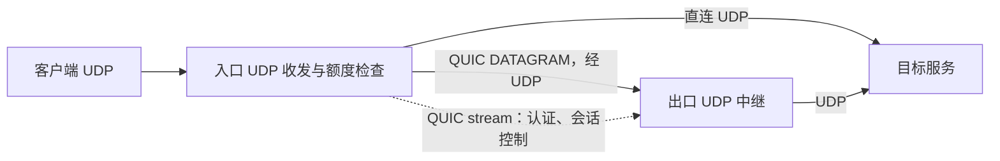

# UDP 原生传输与性能改进计划书

日期：2026-10-09  
代码基线：`v0.1.37` / `3e0364b9834b5b0173fd8236fb80d5608dfee129`  
状态：用户已批准执行；本地代码与功能测试已实施，Linux 性能门槛尚待实测验收。实现记录见 [交付说明](udp-performance-implementation.md)，测量步骤见 [隔离验收手册](udp-performance-lab.md)。

## 1. 已确认的目标与决策

本次同时覆盖两条路径：客户端 → 入口 → 目标，以及客户端 → 入口 → 出口 → 目标。第一条使用普通 UDP 套接字；第二条新增基于 QUIC DATAGRAM 的 UDP 数据通道，业务报文不经过 TCP 数据流。

用户已选择推荐方案：先建立相同硬件、拓扑和负载下的原生 UDP 基线，再按相对指标验收；严格限制可转发额度，通过提前持久化额度预留消除逐包磁盘等待，异常退出时按未完成预留的保守上限恢复。

“原生 UDP”在本计划中指数据承载使用 UDP，并保留业务报文边界、允许丢包和乱序；不表示零代理开销、保留原始客户端 IP/端口，或与内核 NAT 完全相同的性能。QUIC DATAGRAM 仍有加密、协议头和拥塞控制开销，必须公布它相对裸 UDP 的性能差距。

规则表单继续只提供 TCP/UDP 和出口选择。协议嗅探、禁用、UDP over TCP 策略仍由管理员在设备组高级设置配置；UDP 出口能力由出口配置和节点能力决定。

本次性能验收覆盖直连和单出口。TCP、已有 TLS/WS/WSS/HTTP 隧道继续执行兼容性回归；链式出口、反向出口的 UDP 原生承载扩展列入后续工作，不能将其标为本次已达标。

## 2. 现有实现与瓶颈

| 位置 | 当前行为 | 对性能的影响 |
|---|---|---|
| `internal/agent/runtime.go:352`、`:526` | 直连通过 UDP 套接字收发；同一监听器在一个接收循环中处理建连、计量和发送 | 一个慢目标或新会话建连可能阻塞其他客户端 |
| `internal/agent/runtime.go:575`、`:618` | 上下行报文发送前分别调用计量 | 高频小包会产生大量计量请求 |
| `internal/agent/state.go:127`、`:470` | 调用方等待计量请求的持久化结果 | 包处理延迟受到持久化队列影响 |
| `internal/agent/wal.go:277`、`:316` | 每批计量写 WAL 并同步磁盘 | 并发批处理能够摊薄开销，但不能消除每个调用方的等待 |
| `internal/tunnel/tunnel.go:159`、`:264` | UDP 封装为会话帧，经 TCP/TLS 或 WebSocket 发送 | 丢包触发可靠流重传和队头等待 |
| `internal/agent/runtime.go:549` | 每条规则最多 256 个 UDP 会话 | 高并发下形成固定容量上限 |
| `internal/commerce/quota.go`、`internal/agent/state.go:501` | 商业租约预算最多 16 MiB，使用低水位后先退租再重新获取配置 | 大流量下租约切换频繁；1 Gbps 有效载荷约 134 ms 就可用完 16 MiB 原始预算，倍率大于 1 时更快 |
| `internal/platform/resources.go`、`docs/api-contract.md` | `disable_udp` 已执行，`udp_over_tcp` 目前仅保存、校验 | 不能把已有开关当作已实现的 UDP 数据通道选择 |

现有直接 UDP 和四承载测试已经证明报文边界、空报文及计量的功能正确性，未提供 Linux 跨机高包速率的性能证据。旧 Windows 微基准不作为本计划的性能验收依据。

## 3. 性能指标与测量方法

### 3.1 基线定义

所有基线使用同一组机器、网卡、CPU 配额、网络路径、业务报文长度、会话数和方向。端到端有效载荷吞吐以接收端校验后的数据为准，不以发送端写入缓冲区的速度为准。

| 基线 | 测量对象 | 用途 |
|---|---|---|
| B0 | 负载机到目标的裸 UDP，以及各链路的 UDP 容量 | 确认负载机、网络和目标不是隐藏瓶颈 |
| B1 | 与生产路径具有相同跳数的最小 UDP 用户态代理，无计量、无策略 | 比较直连实现额外开销；单出口另外建立相同拓扑的裸 UDP 中继基线 |
| B2 | 相同 QUIC 库、加密、连接数和业务帧格式的最小 DATAGRAM 代理，无产品计量、无策略 | 分离加密和 QUIC 本身的开销与产品额外开销 |
| BK | 条件允许时，相同拓扑的 Linux 内核 DNAT UDP 转发 | 公布与内核转发的差距，不作为跨平台实现必然相等的承诺 |
| V37 | 当前正式版的直连和 UDP over TCP 出口 | 给出升级前后收益，不能替代 B0/B1/B2 |

基线代理必须独立于生产计量路径运行；不能通过关闭生产程序的某个检查就把相同缺陷同时带入基线。P0 冻结环境和各场景的基线值，之后改变环境必须整套重测。

### 3.2 拟定验收门槛

下表是实施目标，尚未实测达成。吞吐和包速率门槛要求在接收端应用丢包率不超过 0.1%、资源配额不超限时成立。

| 指标 | 直连 UDP | 单出口 UDP DATAGRAM |
|---|---|---|
| 1200 字节有效载荷最大稳定吞吐 | ≥ 同拓扑 B1 的 90% | ≥ B2 的 85%，且 ≥ 同拓扑裸 UDP 中继 B1 的 80% |
| 64/256 字节最大稳定包速率 | ≥ 相应 B1 的 85% | ≥ 相应 B2 的 80%；同时公布对裸 UDP B1 的比值 |
| 低负载附加 RTT，P99；低负载为较慢路径容量的 10% | 相对 B1 ≤ 0.5 ms | 相对 B2 ≤ 1 ms |
| 中负载附加 RTT，P99；负载为较慢路径容量的 70% | 相对 B1 ≤ 2 ms | 相对 B2 ≤ 3 ms |
| 无故障、无人工限速时额外应用丢包 | 相对对应基线增加 ≤ 0.1 个百分点 | 相对对应基线增加 ≤ 0.1 个百分点 |
| 多会话能力 | 1/32/256/1024 个会话均测试；同 CPU 配额下与对应基线比较 | 同左；不能为每个业务会话单独建立 QUIC 连接 |
| 24 小时稳定性 | 无无界队列、会话泄漏或计量丢失；预热后的内存、FD、goroutine 数无持续增长 | 同左 |

容量比较必须记录 CPU、每包 CPU 时间、磁盘同步次数、GC、网卡丢包、内核 socket 丢包和产品丢弃原因。持续吞吐不得用无限大租约、关闭计费或关闭策略来达标；至少一轮使用真实有限套餐、多次租约补充和用量上报。

低基线不能掩盖实现缺陷：B0 应先证实目标硬件的可用容量；B1/B2 不能达到预期链路容量时先定位参考程序或硬件。最终同时给出 Mbps/Gbps、PPS、分位延迟及相对比值，不能只发布一个“提升百分比”。

### 3.3 实验矩阵

- 业务载荷：0、64、256、512、1200 字节；另测接近业务 UDP 上限的报文，验证分片行为，后者不纳入常规吞吐门槛。
- 方向：上传、下载、双向；会话数：1、32、256、1024；规则数另测 1、32、128。
- 地址与平台：IPv4/IPv6，Linux amd64/arm64；Windows/macOS 仅作为通用实现的兼容性验证，不代替 Linux 性能验收。
- 网络：RTT 1/20/80 ms，丢包 0/0.1%/1%，受控乱序和突发流量；注入故障后单独报告，不与无损链路的门槛混算。
- 常规场景预热 30 秒、采样 120 秒、重复 5 次，报告中位数及运行范围；最大稳定速率通过逐步增载确定。发布前另做 24 小时稳定性测试。
- 单向微秒延迟仅在时钟同步误差已测量且足够小时使用；默认使用回显 RTT，避免时钟偏差伪造结果。
- 测试载荷带会话 ID、序号和校验值；分别统计缺失、重复、乱序、损坏。抓包只用于确认承载和边界，不能单独证明吞吐。

报文长度指完整业务 UDP 载荷，测试元数据包含在指定长度内；0 字节报文单独做边界和计量正确性验证，不用无法携带序号的空报文证明最大稳定吞吐。

## 4. 技术原理一：提前持久化额度，转发时只扣内存额度

### 4.1 额度模型

保留现有控制面签发的有限商业租约。Agent 在该租约范围内提前为某条规则、方向持久化小块转发额度；WAL 同步成功后，数据处理协程才能使用这块额度。逐包步骤改为策略检查、限速、扣除已持久化额度、套接字发送，磁盘 I/O 移到后台。

定义 `L` 为租约原始字节上限，`S` 为已完成本地持久结算的字节，`R` 为所有未关闭额度窗口剩余的最大结算责任。始终保持：

```text
S + R <= L
某窗口已消耗额度 <= 该窗口容量
实际允许放行的字节 <= 已持久化的授权字节
```

预留是额度占用，不是在预留和最终用量中各扣一次费用。控制面正常用量记录只结算本窗口已持久确认的业务放行字节；后台关闭窗口时释放确定未用的部分。倍率继续按租约累计字节计算取整差额，避免分块大小改变最终计费。

同一租约的 TCP、直接 UDP 和隧道 UDP 共用额度账本；既有 TCP 计量也必须扣除 UDP 已占用但未关闭的责任，不能各自根据 `L - S` 重复授权。首轮只优化 UDP 热路径，TCP 可保留原持久化发送流程，但所有路径统一执行上述不变量。

计量口径保持现有“发送前授权并记账”的保守语义：报文在通过策略、限速和队列准入后，向 socket 提交前扣除额度；提交后出现发送失败仍可能计入已授权的发送尝试。不把 UDP 的 `Write` 成功误解释为对端已经收到。未通过策略、队列满、超过限速而丢弃的报文不扣额度。

### 4.2 窗口参数与持久状态

建议初始窗口为每规则每方向 256 KiB，最多一个使用中窗口和一个已持久化的备用窗口；单规则两方向最多 1 MiB 未关闭责任。单账号在一个 Agent 上的全部窗口合计最多 8 MiB，并同时受当前租约剩余额度约束。小额账户按剩余额度缩小窗口，不使用固定窗口强制拒绝所有小额业务。

这些是首轮实验参数，P0/P1 根据磁盘同步速度、预留补充延迟和可接受的崩溃保守计量上限调整。增大窗口会降低同步频率，也会增大异常退出后的不确定字节上限，不能只为了达标无限放大。

窗口记录包含：窗口 ID、Agent、账号、规则、租约、权益周期、方向、容量、累计持久确认字节、状态、允许使用的截止时间。状态与必要事件如下：

```text
申请预留 → WAL reserve 同步 → 内存可用
内存消耗 → 后台 checkpoint 同步 → 生成稳定 ID 的待上报用量
停止使用 → WAL close 同步 → 释放可证实未用额度
异常退出 → 恢复未关闭窗口 → 保守结算剩余责任 → 禁止复用原窗口
```

关闭窗口必须先阻止新的消耗并等待该窗口的在途操作结束，再把最终累计用量和关闭事件原子持久化，避免“退回未用额度后仍有协程发送”。后台批量 checkpoint 可合并多规则，但不能在未同步前释放额度、产生可确认记录或覆盖旧窗口。

每个 checkpoint、close 和恢复结算以窗口 ID、递增序号和事件类型确定稳定记录 ID，重试复用原 ID。累计确认量只能增加且不能超过窗口容量；新增用量等于相邻持久累计值的差额，不能把累计值再次当作增量上报。WAL 在同一原子批次保存进度与待报事实；服务端拒绝相同 ID 的不同内容，处理重复、乱序和 ACK 丢失时不重复结算。恢复只补齐容量减去已持久确认量，关闭正常窗口不发送负数补偿。

### 4.3 异常退出与用户可见的计量边界

恢复时，每个仍未关闭窗口已经持久确认的部分不再计一次；只对其余未确定部分按预留上限生成恢复结算记录。不知道是否已发送的额度不能重新变成可用额度。

因此正常运行可以按放行计数结算；异常退出可能保守多计未使用的预留额度。一次崩溃的额外原始字节上限为所有未关闭窗口剩余责任之和，受每规则、每账号和租约上限限制。按初始参数，单规则不超过 1 MiB、单账号单 Agent 不超过 8 MiB；收费倍率仍按原账期执行。连续多次异常退出可能分别产生责任，需要在报告中累计展示，不能宣称终身固定上限。

用量事实增加普通/恢复结算分类、窗口标识与序号；后台必须能审计“实际持久确认的放行量”和“崩溃保守结算量”。不能把恢复估算伪装为已证实送达的流量。恢复记录绑定原租约有效区间，不把重启后的时间填进已过期租约，也不归入新购买的套餐周期。

Agent WAL 使用新格式版本及明确迁移：先处理旧待报记录，校验后写新快照；旧程序遇到新格式应明确拒绝。数据路径改变后不能承诺直接二进制降级仍可安全使用新 WAL。

### 4.4 队列、限速与磁盘故障

- 转发协程只尝试领取已经同步的额度；不足时触发后台补充，丢弃当前 UDP 报文并记录 `quota_unavailable`，不等待磁盘或占住其他会话。
- 正常预取使可用额度在稳定负载下持续充足；测试必须统计因补充不及时造成的丢包，不能将其藏在一般网络丢包中。
- 每账号的上下行累计不能绕过带宽限制。使用统一时钟和有界令牌桶，必要时向 worker 发放小批令牌，并限制总突发额与额度责任。
- 存储错误或无法确认持久状态时停止新放行；单纯磁盘慢时只可消耗已持久化额度。不能因“已预留过”而在租约到期、规则撤销或持久存储明确失败后继续发送。
- 用量队列满时停止新增预留；已有窗口能否继续消费由有界恢复状态容量决定。磁盘快照、窗口日志、待报记录全部必须有可计算上限。

## 5. 技术原理二：连续补充商业租约

当前 16 MiB 租约在高速流量下容易反复耗尽，本地 256 KiB 预留不能解决控制面尚未授权的问题。增加可选的租约集合能力，预先申请后续有限额度，并在仍有效的旧租约额度使用完后切换；结算和退租在后台独立完成。

初始设计每规则最多当前、备用两个可花费租约。备用租约已在服务端事务中占用套餐额度，且已在 Agent 持久化；不能用“正在申请”替代已经签发。用量和窗口各自绑定具体租约，严禁多租约混记。

预取阈值依据实际原始字节速率和租约申请 P99 延迟计算，取覆盖申请时间加抖动余量的预算，并设配置上限。新能力节点可使用自适应预算，建议目标覆盖约 2 秒流量，单租约加权预算初始上限 256 MiB、到期仍不超过 5 分钟和权益有效期。实际可分配量受账户剩余额度和全账号跨节点未归还预算上限限制；旧 Agent 继续使用原 16 MiB 单租约。

256 MiB 商业预算是控制面已经占用的套餐额度，不等于本地崩溃多计量窗口；两种上限分别统计。未经确认退租的预算继续占用，不能为了续租把旧额度再次发给其他节点。

规则取消、购买新账期或权益变更时，先停止旧租约的窗口使用、结算和退租，后续流量绑定当前有效账期。配置发布和额度签发仍在可靠事务中完成；SQLite、PostgreSQL、MySQL 必须执行相同幂等与锁顺序。

必须限制未完成退租的租约数量和总预算；控制面上报长期失败时耗尽有限授权后停止。该模型仍是有界离线额度，不保证控制面永久失联时无限速转发。

## 6. 技术原理三：UDP 收发与会话处理

### 6.1 通用路径

把监听接收、会话建立、策略与计量、发送和超时回收拆开。接收循环只读取报文、确定会话归属并放入有界队列，不能执行 DNS、隧道握手、WAL 同步或阻塞式目标建连。

使用会话哈希固定分片；同一会话固定一个 worker，减少全局锁争用并避免实现主动打乱其提交顺序。新会话交给独立的有界建连池；等待建立期间只缓冲少量报文，超限时明确丢弃并释放缓冲。

直接收发缓冲采用复用池并明确所有权，异步队列不得引用下次接收会覆盖的内存。策略版本、额度撤销代数和到期时间在放行前检查；纯租约补充不重建 UDP 会话，目标或策略改变按现有撤销语义执行。

会话上限改为有界配置，初始验证 1024，会话内存、FD 和每账号连接/IP 上限共同生效。当前回包读取超时 30 秒可能关闭持续单向发送的会话，改用双方最近有效活动时间；使用分片超时管理，减少每包创建计时器或频繁设置 deadline。

### 6.2 Linux 路径

在通用实现通过正确性验收后引入 Linux 批量 UDP I/O：通过维护中的 Go 网络库或受控系统调用封装使用 `recvmmsg/sendmmsg`，初始批大小 16/32，逐项处理短批、截断和部分写入。

配置合理的 socket 收发缓冲并确认实际生效值，采集 `SO_RXQ_OVFL` 或对应内核统计。必要时使用 `SO_REUSEPORT` 扩展接收分片，但必须先验证会话归属、回包来源端口、socket 哈希一致性和关闭行为。超时 flush 控制批量等待，避免为吞吐牺牲低负载延迟。

QUIC 的 UDP socket 由 QUIC 库管理，不将普通代理的批量收发封装强行插入库内部。先使用库提供的平台优化和分片连接，只有 profiler 证实其 I/O 为瓶颈时才评估扩展。

计量和报文边界在通用路径与 Linux 批量路径中必须一致。首轮不采用 DPDK、AF_XDP 或 eBPF 全数据面；这些方案改变部署权限和计量架构，在实测证明用户态目标达不到时再提出独立方案。

## 7. 技术原理四：入口到出口采用 QUIC DATAGRAM

### 7.1 选型

首选 `github.com/quic-go/quic-go`，在 P0 核对与项目 Go 版本的兼容性、DATAGRAM 与平台支持后固定维护版依赖，不在计划阶段虚构具体版本。以 QUIC 的 TLS 1.3、证书校验、密钥轮换、地址验证和拥塞控制构建出口通道。认证、创建会话、目标地址和错误响应经可靠 QUIC stream；业务数据仅经 DATAGRAM。



DATAGRAM 丢失不要求重传先前业务数据，因此后续业务报文不等待 TCP 的可靠流修复。它仍受连接拥塞窗口、链路排队和 pacing 影响，不能承诺完全没有会话间竞争或任何网络下零延迟增加。

TLS 证书和入口到出口 token 的认证沿用既有身份原则，但 token 仅在已验证的加密控制流中提交。禁用 0-RTT 开会话和数据发送，避免早期数据重放。正常路径不自制 TLS exporter 加密协议，不把长期 token 直接当报文加密密钥。

### 7.2 会话与复用

每个入口/出口对建立少量 QUIC 连接，初始 1–4 个、受 CPU 配额和配置上限约束；业务会话通过随机不可预测的会话 ID 复用。一个慢目标只占用自己的有界发送队列；不得在 QUIC DATAGRAM 接收循环中同步连接业务目标或等待业务目标发送。

控制帧包含协议版本、会话 ID、业务 UDP 目标、配置版本、有效期、MTU 能力等。出口只在认证和会话授权完成后允许数据；未知、过期、已关闭会话的数据直接丢弃。未认证数据不能创建目标 socket。

QUIC 库负责传输层重放与地址验证。业务层对重复序号和恶意分片另设有界去重、重组限制；不能通过严格单调序号判断把合法 UDP 乱序全部丢弃。源地址变化依赖 QUIC 路径验证，不因收到一个新地址报文就修改回包地址。

出口目标仍由授权的转发规则指定，不恢复已经移除的人工目标白名单。入口和出口组禁用策略、节点能力、规则版本与会话有效期独立校验。

### 7.3 MTU 与报文边界

默认普通业务载荷目标为 1200 字节，但实际 DATAGRAM 可用空间由 QUIC 协商、路径 MTU 和业务头长度决定，不能写死“1200 一定装得下”。

一条业务报文在能容纳时对应一个业务 DATAGRAM；超出时使用有界应用分片，包含原报文 ID、片号、片数、总长度。最大业务报文继续以平台 UDP 能力为限，接收方完整重组后只向目标提交一次；丢失分片则超时丢弃整报文，不补发业务片段，不用 IP 分片承担正确性。

重组容量按会话和连接双重限制，拒绝长度冲突、片数异常、重复片不一致。分片计费只计原业务载荷一次，协议头、加密和重复分片不重复计入业务流量；入口计量位置不因出口协议切换而重复。大报文的效率和丢包风险单独公布。

### 7.4 UDP 可达性、拥塞与 TCP 兼容策略

新 UDP 通道要求出口 UDP 端口可达；网络诊断应主动报告实际采用 DATAGRAM 还是现有 TCP 隧道。UDP 被封锁时给出清晰原因，不能悄悄降级后仍显示“原生 UDP”。

新出口的 UDP 策略由管理员配置。`udp_over_tcp=true` 明确走原有 TCP 隧道；`false` 且启用新 UDP 能力时要求 DATAGRAM 可用。既有出口没有新能力时保留已配置的原行为并标明 UDP over TCP；兼容回退只有管理员明确允许时执行。`disable_udp=true` 始终拒绝 UDP，与 `udp_over_tcp=true` 的冲突校验继续存在。

不能为了测试速率关闭 QUIC 拥塞控制。直连的每账号限速同样执行；互联网 UDP 没有传输层拥塞反馈时，管理员必须能设置速率和突发上限。性能报告区分局域网容量和有 RTT/丢包的公网条件。

## 8. 公共契约、文件范围与兼容性

下列命名是计划中的新增能力，当前代码尚不存在，实施时先冻结契约再修改各模块。

| 模块 | 拟修改范围 | 主要内容 |
|---|---|---|
| 公共契约 | `internal/contract/types.go`、校验与 OpenAPI | 出口可选 UDP 能力配置、QUIC 端点、`udp-datagram-v1` 能力、租约集合、计量窗口/恢复事实；敏感端点与凭据继续按权限隐藏 |
| Agent 计量 | `internal/agent/state.go`、`wal.go`、`limits.go`、`continuity.go` | 新窗口状态机、额度领取、后台补充、恢复、租约切换和 WAL 迁移 |
| Agent UDP | `internal/agent/runtime.go` 及新增 UDP 平台文件 | 分片 worker、异步建连、有界队列、缓冲复用、双方活动超时、Linux 批量路径 |
| 隧道 | `internal/tunnel` 及 `go.mod/go.sum` | QUIC DATAGRAM 连接、控制流、业务会话、分片与诊断；选择冻结时的维护版依赖 |
| 控制面 | `internal/platform/exits.go`、`leases.go`、`usage_batch.go`、节点能力校验 | 按业务网络选择出口、租约补充、禁用策略下发、恢复事实审计、状态诊断 |
| 商业计费 | `internal/commerce/quota.go`、`usage_batch.go`、迁移 | 有界多租约预算、跨节点不超配、倍率累计取整、普通/恢复用量区分 |
| 安装与接入 | `cmd/agent`、Agent 接入脚本与说明 | 出口 UDP 监听参数、能力注册、端口检测和更新说明 |
| 管理界面 | `GroupAdvanced.vue`、`Exits.vue`、`OnboardPanel.vue`、诊断展示 | 管理员配置 UDP 策略与出口 UDP 能力，显示实际承载；规则弹窗不恢复转发方式选项 |
| 测量与验证 | 独立 UDP 压测工具、报告、CI | B0/B1/B2、PPS/吞吐/RTT、失败注入、三库、浏览器、Linux 双架构 |

旧 Exit 的 `transport/tunnel` 继续服务既有 TCP 和兼容隧道，新增独立可选 UDP 配置，避免把所有出口强制改成一种承载。QUIC 相关参数进入 Agent 配置前必须验证入口和出口都支持新能力；旧 Agent 不接收其无法解析的新字段，接口根据协商契约版本生成兼容配置。

计划需要新增 WAL 版本，控制面可能需要新的迁移版本和用量事实字段；不能沿用 v0.1.37 发布说明中的“无数据库迁移”结论。新客户端和旧客户端的读写兼容、配置签名和导入/导出分别测试。

规则删除必须等待新 UDP 会话和旧额度窗口停止、最终事实确认，再释放端口与归属。UDP 监听端口预留继续按节点/网络/端口规则处理；同端口的 TCP 控制服务和 UDP 数据服务需各自校验，不混用预留记录。

## 9. 实施阶段与退出条件

| 阶段 | 交付内容 | 开始条件 | 退出条件 |
|---|---|---|---|
| P0：建立基线与冻结契约 | 测量工具、B0/B1/B2/V37，确定硬件、速率绝对值、MTU、计量与租约契约 | 用户批准本计划；可进行本地实现和隔离实验 | 报告可复现；基线有效；性能门槛、崩溃责任上限与版本兼容明确 |
| P1：额度窗口与恢复 | 窗口状态机、WAL 迁移、后台结算、恢复审计 | P0 契约冻结 | 并发消费不超额；正常结算一致；每个崩溃点幂等恢复；用户可见恢复计量上限成立 |
| P2：租约补充 | 有界多租约、预取、旧账期结算、三库兼容 | P1 计量不变量通过 | 有限套餐持续跨租约；无重复分配、无周期错记；控制面故障时只消耗授权额度 |
| P3：直连 UDP 优化 | 通用 worker、异步建连、批量收发、缓冲和会话管理 | P1/P2 完成 | 直连吞吐/PPS/延迟门槛通过；无策略/限速旁路，慢目标隔离成立 |
| P4：单出口 UDP 通道 | QUIC DATAGRAM、控制流、MTU/分片、出口选择与部署 | 计量模型稳定、P0 协议契约冻结 | 网卡上业务承载为 UDP；失包不引入可靠流等待；功能和单出口性能门槛通过 |
| P5：管理策略与兼容 | 管理员 UDP 策略、诊断、旧节点、脚本、导入/导出 | P3/P4 功能稳定 | 不恢复规则转发方式下拉；实际协议展示准确；新旧节点行为与端口校验通过 |
| P6：长稳、报告与发布准备 | 24 小时实测、三库/双架构、升级恢复、完整报告 | 前述门槛通过，Linux 测试环境可用 | 所有强制项有证据；性能数据和限制透明；发布产物可复核 |

任何阶段不达标，先分析 profiler、磁盘或网络证据，优化后重测对应受影响场景。不得静默降低验收门槛、关闭计量来通过，或用 TCP 回退结果冒充 UDP 通道结果。需要改变费用语义、崩溃上限或传输选型时更新本计划并重新提交用户审批。

## 10. 必须验证的正确性与故障场景

- 报文边界、空报文、乱序、重复、IPv4/IPv6、MTU 变化、大报文分片缺失及重组资源上限。
- 多 worker 及 TCP/UDP 同时扣同一租约、窗口边界、剩余额度小于单包、预取失败、窗口关闭与发送并发。
- 在 reserve 写入前/后、同步前/后、数据发送前/后、checkpoint 和 close 的每个边界强制终止；重启不得恢复已用额度、漏记或重复扣费。
- 磁盘短写、磁盘满、慢同步、用量接口超时、ACK 丢失、重复/乱序上报、快照损坏；有限状态容量不能超限。
- 购买新周期、倍率变化、旧租约迟到上报、账户禁用、组撤权、规则删除、租约到期、多节点争用剩余额度。
- 未认证控制请求、错误 token、证书错误、未知/过期会话、报文篡改、重放、异常分片、NAT 地址变化和出口重启。
- 网络禁用 UDP、管理员强制 UDP over TCP、旧节点无新能力、禁止隐式回退、链式/反向旧路径回归。
- TCP 连接、Proxy Protocol、TLS 共享端口、旧四种承载的计量和租约连续性回归。

测试应验证不变量和端到端行为，不逐行复制实现。可控 Linux 网络实验、负载工具和故障注入在隔离测试环境运行；生产环境压测与部署需要明确的主机和测试范围。

## 11. 环境与交付清单

当前工作区为 Windows 开发环境。审批后可完成代码、单元/集成测试和隔离回环实验；Linux 性能指标最终需要独立负载机、入口、出口、目标，或经验证不会相互争用资源的隔离拓扑。建议先 1 Gbps，再在具备条件的环境测 10 Gbps；实际规格和 CPU 配额在 P0 登记。

测量记录至少包括：CPU 型号/核数/配额、内存、Linux/Go/QUIC 库版本、网卡与 MTU、链路速率、RTT/丢包、存储同步延迟、进程亲和性和后台负载。参考程序和生产程序使用相同条件。

如果 Linux 测试条件不足，代码可以完成并报告已有证据，但性能验收标记为待验证；不能从 Windows 回环数字推断 Linux 双机已达标。

实施完成提交以下产物：

1. 可审查的分阶段代码与兼容迁移，管理员配置和接入说明。
2. 可复现 UDP 测量工具、原始结果、环境清单和统计报告。
3. 直连与单出口的 Mbps/PPS/延迟/丢包/资源图表，分别对比 B0/B1/B2/V37，条件允许时包含 BK。
4. 正常计量对账、异常退出保守计量上限、多租约补充和三库一致性报告。
5. 升级、回滚与发布准备说明。回滚需先停止新窗口并确认计量、关闭新通道，保留审计事实；不能直接让旧程序读取新 WAL。公网证书/端口/部署验证另记录实际环境证据。

## 12. 用户审批范围

批准本计划后授权实施 P0–P6 的本地代码、测试、文档和隔离实验；本计划本身不授权访问尚未提供的服务器、开展生产压测、修改生产账户计量、发布版本或部署。

本地实施完成后，用户另行明确要求“git提交推送并发版”，授权将现有实现纳入 v0.1.38。该后续授权覆盖版本发布；性能验收门槛仍保持原值，尚无实测证据的项目继续标记待测，用户服务器部署和生产压测仍需具体环境与范围。

审批重点为：两条 UDP 路径、相对性能门槛、QUIC DATAGRAM 选型、正常计量与崩溃保守结算的边界、额度窗口责任上限、多租约预算，以及需要 Linux 真实环境才能证明最终性能。

依据用户“编写完计划后由我审批执行”的要求，在用户明确批准前不实施代码修改。本计划的权限限制来自本次用户指令，不来自既有执行计划或技能文件。
